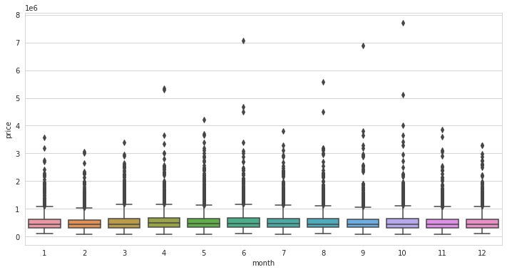
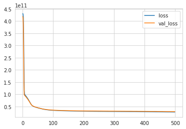

# Deep Learning: Regression using Keras for House Price Prediction 

Dataset: 
https://www.kaggle.com/harlfoxem/housesalesprediction

The features of this dataset are: 

* id - Unique ID for each home sold
* date - Date of the home sale
* price - Price of each home sold
* bedrooms - Number of bedrooms
* bathrooms - Number of bathrooms, where .5 accounts for a room with a toilet but no shower
* sqft_living - Square footage of the apartments interior living space
* sqft_lot - Square footage of the land space
* floors - Number of floors
* waterfront - A dummy variable for whether the apartment was overlooking the waterfront or not
* view - An index from 0 to 4 of how good the view of the property was
* condition - An index from 1 to 5 on the condition of the apartment,
* grade - An index from 1 to 13, where 1-3 falls short of building construction and design, 7 has an average level of construction and design, and 11-13 have a high quality level of construction and design.
* sqft_above - The square footage of the interior housing space that is above ground level
* sqft_basement - The square footage of the interior housing space that is below ground level
* yr_built - The year the house was initially built
* yr_renovated - The year of the house’s last renovation
* zipcode - What zipcode area the house is in
* lat - Lattitude
* long - Longitude
* sqft_living15 - The square footage of interior housing living space for the nearest 15 neighbors
* sqft_lot15 - The square footage of the land lots of the nearest 15 neighbors

## Imports


```python
import pandas as pd
import numpy as np
import matplotlib.pyplot as plt
import seaborn as sns
%matplotlib inline
```


```python
df = pd.read_csv("../DATA/kc_house_data.csv")
```


```python
df.head()
```


<div>
<style scoped>
    .dataframe tbody tr th:only-of-type {
        vertical-align: middle;
    }

    .dataframe tbody tr th {
        vertical-align: top;
    }

    .dataframe thead th {
        text-align: right;
    }
</style>
<table border="1" class="dataframe">
  <thead>
    <tr style="text-align: right;">
      <th></th>
      <th>id</th>
      <th>date</th>
      <th>price</th>
      <th>bedrooms</th>
      <th>bathrooms</th>
      <th>sqft_living</th>
      <th>sqft_lot</th>
      <th>floors</th>
      <th>waterfront</th>
      <th>view</th>
      <th>...</th>
      <th>grade</th>
      <th>sqft_above</th>
      <th>sqft_basement</th>
      <th>yr_built</th>
      <th>yr_renovated</th>
      <th>zipcode</th>
      <th>lat</th>
      <th>long</th>
      <th>sqft_living15</th>
      <th>sqft_lot15</th>
    </tr>
  </thead>
  <tbody>
    <tr>
      <th>0</th>
      <td>7129300520</td>
      <td>10/13/2014</td>
      <td>221900.0</td>
      <td>3</td>
      <td>1.00</td>
      <td>1180</td>
      <td>5650</td>
      <td>1.0</td>
      <td>0</td>
      <td>0</td>
      <td>...</td>
      <td>7</td>
      <td>1180</td>
      <td>0</td>
      <td>1955</td>
      <td>0</td>
      <td>98178</td>
      <td>47.5112</td>
      <td>-122.257</td>
      <td>1340</td>
      <td>5650</td>
    </tr>
    <tr>
      <th>1</th>
      <td>6414100192</td>
      <td>12/9/2014</td>
      <td>538000.0</td>
      <td>3</td>
      <td>2.25</td>
      <td>2570</td>
      <td>7242</td>
      <td>2.0</td>
      <td>0</td>
      <td>0</td>
      <td>...</td>
      <td>7</td>
      <td>2170</td>
      <td>400</td>
      <td>1951</td>
      <td>1991</td>
      <td>98125</td>
      <td>47.7210</td>
      <td>-122.319</td>
      <td>1690</td>
      <td>7639</td>
    </tr>
    <tr>
      <th>2</th>
      <td>5631500400</td>
      <td>2/25/2015</td>
      <td>180000.0</td>
      <td>2</td>
      <td>1.00</td>
      <td>770</td>
      <td>10000</td>
      <td>1.0</td>
      <td>0</td>
      <td>0</td>
      <td>...</td>
      <td>6</td>
      <td>770</td>
      <td>0</td>
      <td>1933</td>
      <td>0</td>
      <td>98028</td>
      <td>47.7379</td>
      <td>-122.233</td>
      <td>2720</td>
      <td>8062</td>
    </tr>
    <tr>
      <th>3</th>
      <td>2487200875</td>
      <td>12/9/2014</td>
      <td>604000.0</td>
      <td>4</td>
      <td>3.00</td>
      <td>1960</td>
      <td>5000</td>
      <td>1.0</td>
      <td>0</td>
      <td>0</td>
      <td>...</td>
      <td>7</td>
      <td>1050</td>
      <td>910</td>
      <td>1965</td>
      <td>0</td>
      <td>98136</td>
      <td>47.5208</td>
      <td>-122.393</td>
      <td>1360</td>
      <td>5000</td>
    </tr>
    <tr>
      <th>4</th>
      <td>1954400510</td>
      <td>2/18/2015</td>
      <td>510000.0</td>
      <td>3</td>
      <td>2.00</td>
      <td>1680</td>
      <td>8080</td>
      <td>1.0</td>
      <td>0</td>
      <td>0</td>
      <td>...</td>
      <td>8</td>
      <td>1680</td>
      <td>0</td>
      <td>1987</td>
      <td>0</td>
      <td>98074</td>
      <td>47.6168</td>
      <td>-122.045</td>
      <td>1800</td>
      <td>7503</td>
    </tr>
  </tbody>
</table>
<p>5 rows × 21 columns</p>
</div>


```python
df.info()
```

    <class 'pandas.core.frame.DataFrame'>
    RangeIndex: 21597 entries, 0 to 21596
    Data columns (total 21 columns):
     #   Column         Non-Null Count  Dtype  
    ---  ------         --------------  -----  
     0   id             21597 non-null  int64  
     1   date           21597 non-null  object 
     2   price          21597 non-null  float64
     3   bedrooms       21597 non-null  int64  
     4   bathrooms      21597 non-null  float64
     5   sqft_living    21597 non-null  int64  
     6   sqft_lot       21597 non-null  int64  
     7   floors         21597 non-null  float64
     8   waterfront     21597 non-null  int64  
     9   view           21597 non-null  int64  
     10  condition      21597 non-null  int64  
     11  grade          21597 non-null  int64  
     12  sqft_above     21597 non-null  int64  
     13  sqft_basement  21597 non-null  int64  
     14  yr_built       21597 non-null  int64  
     15  yr_renovated   21597 non-null  int64  
     16  zipcode        21597 non-null  int64  
     17  lat            21597 non-null  float64
     18  long           21597 non-null  float64
     19  sqft_living15  21597 non-null  int64  
     20  sqft_lot15     21597 non-null  int64  
    dtypes: float64(5), int64(15), object(1)
    memory usage: 3.5+ MB


```python
df.describe().transpose()
```


<div>
<style scoped>
    .dataframe tbody tr th:only-of-type {
        vertical-align: middle;
    }

    .dataframe tbody tr th {
        vertical-align: top;
    }

    .dataframe thead th {
        text-align: right;
    }
</style>
<table border="1" class="dataframe">
  <thead>
    <tr style="text-align: right;">
      <th></th>
      <th>count</th>
      <th>mean</th>
      <th>std</th>
      <th>min</th>
      <th>25%</th>
      <th>50%</th>
      <th>75%</th>
      <th>max</th>
    </tr>
  </thead>
  <tbody>
    <tr>
      <th>id</th>
      <td>21597.0</td>
      <td>4.580474e+09</td>
      <td>2.876736e+09</td>
      <td>1.000102e+06</td>
      <td>2.123049e+09</td>
      <td>3.904930e+09</td>
      <td>7.308900e+09</td>
      <td>9.900000e+09</td>
    </tr>
    <tr>
      <th>price</th>
      <td>21597.0</td>
      <td>5.402966e+05</td>
      <td>3.673681e+05</td>
      <td>7.800000e+04</td>
      <td>3.220000e+05</td>
      <td>4.500000e+05</td>
      <td>6.450000e+05</td>
      <td>7.700000e+06</td>
    </tr>
    <tr>
      <th>bedrooms</th>
      <td>21597.0</td>
      <td>3.373200e+00</td>
      <td>9.262989e-01</td>
      <td>1.000000e+00</td>
      <td>3.000000e+00</td>
      <td>3.000000e+00</td>
      <td>4.000000e+00</td>
      <td>3.300000e+01</td>
    </tr>
    <tr>
      <th>bathrooms</th>
      <td>21597.0</td>
      <td>2.115826e+00</td>
      <td>7.689843e-01</td>
      <td>5.000000e-01</td>
      <td>1.750000e+00</td>
      <td>2.250000e+00</td>
      <td>2.500000e+00</td>
      <td>8.000000e+00</td>
    </tr>
    <tr>
      <th>sqft_living</th>
      <td>21597.0</td>
      <td>2.080322e+03</td>
      <td>9.181061e+02</td>
      <td>3.700000e+02</td>
      <td>1.430000e+03</td>
      <td>1.910000e+03</td>
      <td>2.550000e+03</td>
      <td>1.354000e+04</td>
    </tr>
    <tr>
      <th>sqft_lot</th>
      <td>21597.0</td>
      <td>1.509941e+04</td>
      <td>4.141264e+04</td>
      <td>5.200000e+02</td>
      <td>5.040000e+03</td>
      <td>7.618000e+03</td>
      <td>1.068500e+04</td>
      <td>1.651359e+06</td>
    </tr>
    <tr>
      <th>floors</th>
      <td>21597.0</td>
      <td>1.494096e+00</td>
      <td>5.396828e-01</td>
      <td>1.000000e+00</td>
      <td>1.000000e+00</td>
      <td>1.500000e+00</td>
      <td>2.000000e+00</td>
      <td>3.500000e+00</td>
    </tr>
    <tr>
      <th>waterfront</th>
      <td>21597.0</td>
      <td>7.547345e-03</td>
      <td>8.654900e-02</td>
      <td>0.000000e+00</td>
      <td>0.000000e+00</td>
      <td>0.000000e+00</td>
      <td>0.000000e+00</td>
      <td>1.000000e+00</td>
    </tr>
    <tr>
      <th>view</th>
      <td>21597.0</td>
      <td>2.342918e-01</td>
      <td>7.663898e-01</td>
      <td>0.000000e+00</td>
      <td>0.000000e+00</td>
      <td>0.000000e+00</td>
      <td>0.000000e+00</td>
      <td>4.000000e+00</td>
    </tr>
    <tr>
      <th>condition</th>
      <td>21597.0</td>
      <td>3.409825e+00</td>
      <td>6.505456e-01</td>
      <td>1.000000e+00</td>
      <td>3.000000e+00</td>
      <td>3.000000e+00</td>
      <td>4.000000e+00</td>
      <td>5.000000e+00</td>
    </tr>
    <tr>
      <th>grade</th>
      <td>21597.0</td>
      <td>7.657915e+00</td>
      <td>1.173200e+00</td>
      <td>3.000000e+00</td>
      <td>7.000000e+00</td>
      <td>7.000000e+00</td>
      <td>8.000000e+00</td>
      <td>1.300000e+01</td>
    </tr>
    <tr>
      <th>sqft_above</th>
      <td>21597.0</td>
      <td>1.788597e+03</td>
      <td>8.277598e+02</td>
      <td>3.700000e+02</td>
      <td>1.190000e+03</td>
      <td>1.560000e+03</td>
      <td>2.210000e+03</td>
      <td>9.410000e+03</td>
    </tr>
    <tr>
      <th>sqft_basement</th>
      <td>21597.0</td>
      <td>2.917250e+02</td>
      <td>4.426678e+02</td>
      <td>0.000000e+00</td>
      <td>0.000000e+00</td>
      <td>0.000000e+00</td>
      <td>5.600000e+02</td>
      <td>4.820000e+03</td>
    </tr>
    <tr>
      <th>yr_built</th>
      <td>21597.0</td>
      <td>1.971000e+03</td>
      <td>2.937523e+01</td>
      <td>1.900000e+03</td>
      <td>1.951000e+03</td>
      <td>1.975000e+03</td>
      <td>1.997000e+03</td>
      <td>2.015000e+03</td>
    </tr>
    <tr>
      <th>yr_renovated</th>
      <td>21597.0</td>
      <td>8.446479e+01</td>
      <td>4.018214e+02</td>
      <td>0.000000e+00</td>
      <td>0.000000e+00</td>
      <td>0.000000e+00</td>
      <td>0.000000e+00</td>
      <td>2.015000e+03</td>
    </tr>
    <tr>
      <th>zipcode</th>
      <td>21597.0</td>
      <td>9.807795e+04</td>
      <td>5.351307e+01</td>
      <td>9.800100e+04</td>
      <td>9.803300e+04</td>
      <td>9.806500e+04</td>
      <td>9.811800e+04</td>
      <td>9.819900e+04</td>
    </tr>
    <tr>
      <th>lat</th>
      <td>21597.0</td>
      <td>4.756009e+01</td>
      <td>1.385518e-01</td>
      <td>4.715590e+01</td>
      <td>4.747110e+01</td>
      <td>4.757180e+01</td>
      <td>4.767800e+01</td>
      <td>4.777760e+01</td>
    </tr>
    <tr>
      <th>long</th>
      <td>21597.0</td>
      <td>-1.222140e+02</td>
      <td>1.407235e-01</td>
      <td>-1.225190e+02</td>
      <td>-1.223280e+02</td>
      <td>-1.222310e+02</td>
      <td>-1.221250e+02</td>
      <td>-1.213150e+02</td>
    </tr>
    <tr>
      <th>sqft_living15</th>
      <td>21597.0</td>
      <td>1.986620e+03</td>
      <td>6.852305e+02</td>
      <td>3.990000e+02</td>
      <td>1.490000e+03</td>
      <td>1.840000e+03</td>
      <td>2.360000e+03</td>
      <td>6.210000e+03</td>
    </tr>
    <tr>
      <th>sqft_lot15</th>
      <td>21597.0</td>
      <td>1.275828e+04</td>
      <td>2.727444e+04</td>
      <td>6.510000e+02</td>
      <td>5.100000e+03</td>
      <td>7.620000e+03</td>
      <td>1.008300e+04</td>
      <td>8.712000e+05</td>
    </tr>
  </tbody>
</table>
</div>


```python
# Check if null data exists
df.isnull().sum()
```


    id               0
    date             0
    price            0
    bedrooms         0
    bathrooms        0
    sqft_living      0
    sqft_lot         0
    floors           0
    waterfront       0
    view             0
    condition        0
    grade            0
    sqft_above       0
    sqft_basement    0
    yr_built         0
    yr_renovated     0
    zipcode          0
    lat              0
    long             0
    sqft_living15    0
    sqft_lot15       0
    dtype: int64


## Data Visualiztion


```python
plt.figure(figsize=(10,6))
sns.set_style("whitegrid")
sns.distplot(df["price"])
```

    /home/bogeymantan/anaconda3/lib/python3.9/site-packages/seaborn/distributions.py:2619: FutureWarning: `distplot` is a deprecated function and will be removed in a future version. Please adapt your code to use either `displot` (a figure-level function with similar flexibility) or `histplot` (an axes-level function for histograms).
      warnings.warn(msg, FutureWarning)


    <AxesSubplot:xlabel='price', ylabel='Density'>


    

    


```python
plt.figure(figsize=(10,6))
sns.countplot(df["bedrooms"])
```

    /home/bogeymantan/anaconda3/lib/python3.9/site-packages/seaborn/_decorators.py:36: FutureWarning: Pass the following variable as a keyword arg: x. From version 0.12, the only valid positional argument will be `data`, and passing other arguments without an explicit keyword will result in an error or misinterpretation.
      warnings.warn(


    <AxesSubplot:xlabel='bedrooms', ylabel='count'>


    

    


```python
df.corr()
```


<div>
<style scoped>
    .dataframe tbody tr th:only-of-type {
        vertical-align: middle;
    }

    .dataframe tbody tr th {
        vertical-align: top;
    }

    .dataframe thead th {
        text-align: right;
    }
</style>
<table border="1" class="dataframe">
  <thead>
    <tr style="text-align: right;">
      <th></th>
      <th>id</th>
      <th>price</th>
      <th>bedrooms</th>
      <th>bathrooms</th>
      <th>sqft_living</th>
      <th>sqft_lot</th>
      <th>floors</th>
      <th>waterfront</th>
      <th>view</th>
      <th>condition</th>
      <th>grade</th>
      <th>sqft_above</th>
      <th>sqft_basement</th>
      <th>yr_built</th>
      <th>yr_renovated</th>
      <th>zipcode</th>
      <th>lat</th>
      <th>long</th>
      <th>sqft_living15</th>
      <th>sqft_lot15</th>
    </tr>
  </thead>
  <tbody>
    <tr>
      <th>id</th>
      <td>1.000000</td>
      <td>-0.016772</td>
      <td>0.001150</td>
      <td>0.005162</td>
      <td>-0.012241</td>
      <td>-0.131911</td>
      <td>0.018608</td>
      <td>-0.002727</td>
      <td>0.011536</td>
      <td>-0.023803</td>
      <td>0.008188</td>
      <td>-0.010799</td>
      <td>-0.005193</td>
      <td>0.021617</td>
      <td>-0.016925</td>
      <td>-0.008211</td>
      <td>-0.001798</td>
      <td>0.020672</td>
      <td>-0.002701</td>
      <td>-0.138557</td>
    </tr>
    <tr>
      <th>price</th>
      <td>-0.016772</td>
      <td>1.000000</td>
      <td>0.308787</td>
      <td>0.525906</td>
      <td>0.701917</td>
      <td>0.089876</td>
      <td>0.256804</td>
      <td>0.266398</td>
      <td>0.397370</td>
      <td>0.036056</td>
      <td>0.667951</td>
      <td>0.605368</td>
      <td>0.323799</td>
      <td>0.053953</td>
      <td>0.126424</td>
      <td>-0.053402</td>
      <td>0.306692</td>
      <td>0.022036</td>
      <td>0.585241</td>
      <td>0.082845</td>
    </tr>
    <tr>
      <th>bedrooms</th>
      <td>0.001150</td>
      <td>0.308787</td>
      <td>1.000000</td>
      <td>0.514508</td>
      <td>0.578212</td>
      <td>0.032471</td>
      <td>0.177944</td>
      <td>-0.006834</td>
      <td>0.080008</td>
      <td>0.026496</td>
      <td>0.356563</td>
      <td>0.479386</td>
      <td>0.302808</td>
      <td>0.155670</td>
      <td>0.018389</td>
      <td>-0.154092</td>
      <td>-0.009951</td>
      <td>0.132054</td>
      <td>0.393406</td>
      <td>0.030690</td>
    </tr>
    <tr>
      <th>bathrooms</th>
      <td>0.005162</td>
      <td>0.525906</td>
      <td>0.514508</td>
      <td>1.000000</td>
      <td>0.755758</td>
      <td>0.088373</td>
      <td>0.502582</td>
      <td>0.063744</td>
      <td>0.188386</td>
      <td>-0.126479</td>
      <td>0.665838</td>
      <td>0.686668</td>
      <td>0.283440</td>
      <td>0.507173</td>
      <td>0.050544</td>
      <td>-0.204786</td>
      <td>0.024280</td>
      <td>0.224903</td>
      <td>0.569884</td>
      <td>0.088303</td>
    </tr>
    <tr>
      <th>sqft_living</th>
      <td>-0.012241</td>
      <td>0.701917</td>
      <td>0.578212</td>
      <td>0.755758</td>
      <td>1.000000</td>
      <td>0.173453</td>
      <td>0.353953</td>
      <td>0.103854</td>
      <td>0.284709</td>
      <td>-0.059445</td>
      <td>0.762779</td>
      <td>0.876448</td>
      <td>0.435130</td>
      <td>0.318152</td>
      <td>0.055308</td>
      <td>-0.199802</td>
      <td>0.052155</td>
      <td>0.241214</td>
      <td>0.756402</td>
      <td>0.184342</td>
    </tr>
    <tr>
      <th>sqft_lot</th>
      <td>-0.131911</td>
      <td>0.089876</td>
      <td>0.032471</td>
      <td>0.088373</td>
      <td>0.173453</td>
      <td>1.000000</td>
      <td>-0.004814</td>
      <td>0.021632</td>
      <td>0.074900</td>
      <td>-0.008830</td>
      <td>0.114731</td>
      <td>0.184139</td>
      <td>0.015418</td>
      <td>0.052946</td>
      <td>0.007686</td>
      <td>-0.129586</td>
      <td>-0.085514</td>
      <td>0.230227</td>
      <td>0.144763</td>
      <td>0.718204</td>
    </tr>
    <tr>
      <th>floors</th>
      <td>0.018608</td>
      <td>0.256804</td>
      <td>0.177944</td>
      <td>0.502582</td>
      <td>0.353953</td>
      <td>-0.004814</td>
      <td>1.000000</td>
      <td>0.023755</td>
      <td>0.028814</td>
      <td>-0.264075</td>
      <td>0.458794</td>
      <td>0.523989</td>
      <td>-0.245715</td>
      <td>0.489193</td>
      <td>0.006427</td>
      <td>-0.059541</td>
      <td>0.049239</td>
      <td>0.125943</td>
      <td>0.280102</td>
      <td>-0.010722</td>
    </tr>
    <tr>
      <th>waterfront</th>
      <td>-0.002727</td>
      <td>0.266398</td>
      <td>-0.006834</td>
      <td>0.063744</td>
      <td>0.103854</td>
      <td>0.021632</td>
      <td>0.023755</td>
      <td>1.000000</td>
      <td>0.401971</td>
      <td>0.016611</td>
      <td>0.082888</td>
      <td>0.072109</td>
      <td>0.080559</td>
      <td>-0.026153</td>
      <td>0.092873</td>
      <td>0.030272</td>
      <td>-0.014306</td>
      <td>-0.041904</td>
      <td>0.086507</td>
      <td>0.030781</td>
    </tr>
    <tr>
      <th>view</th>
      <td>0.011536</td>
      <td>0.397370</td>
      <td>0.080008</td>
      <td>0.188386</td>
      <td>0.284709</td>
      <td>0.074900</td>
      <td>0.028814</td>
      <td>0.401971</td>
      <td>1.000000</td>
      <td>0.045999</td>
      <td>0.251728</td>
      <td>0.167609</td>
      <td>0.277078</td>
      <td>-0.053636</td>
      <td>0.103951</td>
      <td>0.084622</td>
      <td>0.005871</td>
      <td>-0.078107</td>
      <td>0.280681</td>
      <td>0.072904</td>
    </tr>
    <tr>
      <th>condition</th>
      <td>-0.023803</td>
      <td>0.036056</td>
      <td>0.026496</td>
      <td>-0.126479</td>
      <td>-0.059445</td>
      <td>-0.008830</td>
      <td>-0.264075</td>
      <td>0.016611</td>
      <td>0.045999</td>
      <td>1.000000</td>
      <td>-0.146896</td>
      <td>-0.158904</td>
      <td>0.173849</td>
      <td>-0.361592</td>
      <td>-0.060788</td>
      <td>0.002888</td>
      <td>-0.015102</td>
      <td>-0.105877</td>
      <td>-0.093072</td>
      <td>-0.003126</td>
    </tr>
    <tr>
      <th>grade</th>
      <td>0.008188</td>
      <td>0.667951</td>
      <td>0.356563</td>
      <td>0.665838</td>
      <td>0.762779</td>
      <td>0.114731</td>
      <td>0.458794</td>
      <td>0.082888</td>
      <td>0.251728</td>
      <td>-0.146896</td>
      <td>1.000000</td>
      <td>0.756073</td>
      <td>0.168220</td>
      <td>0.447865</td>
      <td>0.014261</td>
      <td>-0.185771</td>
      <td>0.113575</td>
      <td>0.200341</td>
      <td>0.713867</td>
      <td>0.120981</td>
    </tr>
    <tr>
      <th>sqft_above</th>
      <td>-0.010799</td>
      <td>0.605368</td>
      <td>0.479386</td>
      <td>0.686668</td>
      <td>0.876448</td>
      <td>0.184139</td>
      <td>0.523989</td>
      <td>0.072109</td>
      <td>0.167609</td>
      <td>-0.158904</td>
      <td>0.756073</td>
      <td>1.000000</td>
      <td>-0.052156</td>
      <td>0.424037</td>
      <td>0.023251</td>
      <td>-0.261570</td>
      <td>-0.001199</td>
      <td>0.344842</td>
      <td>0.731767</td>
      <td>0.195077</td>
    </tr>
    <tr>
      <th>sqft_basement</th>
      <td>-0.005193</td>
      <td>0.323799</td>
      <td>0.302808</td>
      <td>0.283440</td>
      <td>0.435130</td>
      <td>0.015418</td>
      <td>-0.245715</td>
      <td>0.080559</td>
      <td>0.277078</td>
      <td>0.173849</td>
      <td>0.168220</td>
      <td>-0.052156</td>
      <td>1.000000</td>
      <td>-0.133064</td>
      <td>0.071233</td>
      <td>0.074725</td>
      <td>0.110414</td>
      <td>-0.144546</td>
      <td>0.200443</td>
      <td>0.017550</td>
    </tr>
    <tr>
      <th>yr_built</th>
      <td>0.021617</td>
      <td>0.053953</td>
      <td>0.155670</td>
      <td>0.507173</td>
      <td>0.318152</td>
      <td>0.052946</td>
      <td>0.489193</td>
      <td>-0.026153</td>
      <td>-0.053636</td>
      <td>-0.361592</td>
      <td>0.447865</td>
      <td>0.424037</td>
      <td>-0.133064</td>
      <td>1.000000</td>
      <td>-0.224907</td>
      <td>-0.347210</td>
      <td>-0.148370</td>
      <td>0.409993</td>
      <td>0.326377</td>
      <td>0.070777</td>
    </tr>
    <tr>
      <th>yr_renovated</th>
      <td>-0.016925</td>
      <td>0.126424</td>
      <td>0.018389</td>
      <td>0.050544</td>
      <td>0.055308</td>
      <td>0.007686</td>
      <td>0.006427</td>
      <td>0.092873</td>
      <td>0.103951</td>
      <td>-0.060788</td>
      <td>0.014261</td>
      <td>0.023251</td>
      <td>0.071233</td>
      <td>-0.224907</td>
      <td>1.000000</td>
      <td>0.064325</td>
      <td>0.029350</td>
      <td>-0.068321</td>
      <td>-0.002695</td>
      <td>0.007944</td>
    </tr>
    <tr>
      <th>zipcode</th>
      <td>-0.008211</td>
      <td>-0.053402</td>
      <td>-0.154092</td>
      <td>-0.204786</td>
      <td>-0.199802</td>
      <td>-0.129586</td>
      <td>-0.059541</td>
      <td>0.030272</td>
      <td>0.084622</td>
      <td>0.002888</td>
      <td>-0.185771</td>
      <td>-0.261570</td>
      <td>0.074725</td>
      <td>-0.347210</td>
      <td>0.064325</td>
      <td>1.000000</td>
      <td>0.266742</td>
      <td>-0.564259</td>
      <td>-0.279299</td>
      <td>-0.147294</td>
    </tr>
    <tr>
      <th>lat</th>
      <td>-0.001798</td>
      <td>0.306692</td>
      <td>-0.009951</td>
      <td>0.024280</td>
      <td>0.052155</td>
      <td>-0.085514</td>
      <td>0.049239</td>
      <td>-0.014306</td>
      <td>0.005871</td>
      <td>-0.015102</td>
      <td>0.113575</td>
      <td>-0.001199</td>
      <td>0.110414</td>
      <td>-0.148370</td>
      <td>0.029350</td>
      <td>0.266742</td>
      <td>1.000000</td>
      <td>-0.135371</td>
      <td>0.048679</td>
      <td>-0.086139</td>
    </tr>
    <tr>
      <th>long</th>
      <td>0.020672</td>
      <td>0.022036</td>
      <td>0.132054</td>
      <td>0.224903</td>
      <td>0.241214</td>
      <td>0.230227</td>
      <td>0.125943</td>
      <td>-0.041904</td>
      <td>-0.078107</td>
      <td>-0.105877</td>
      <td>0.200341</td>
      <td>0.344842</td>
      <td>-0.144546</td>
      <td>0.409993</td>
      <td>-0.068321</td>
      <td>-0.564259</td>
      <td>-0.135371</td>
      <td>1.000000</td>
      <td>0.335626</td>
      <td>0.255586</td>
    </tr>
    <tr>
      <th>sqft_living15</th>
      <td>-0.002701</td>
      <td>0.585241</td>
      <td>0.393406</td>
      <td>0.569884</td>
      <td>0.756402</td>
      <td>0.144763</td>
      <td>0.280102</td>
      <td>0.086507</td>
      <td>0.280681</td>
      <td>-0.093072</td>
      <td>0.713867</td>
      <td>0.731767</td>
      <td>0.200443</td>
      <td>0.326377</td>
      <td>-0.002695</td>
      <td>-0.279299</td>
      <td>0.048679</td>
      <td>0.335626</td>
      <td>1.000000</td>
      <td>0.183515</td>
    </tr>
    <tr>
      <th>sqft_lot15</th>
      <td>-0.138557</td>
      <td>0.082845</td>
      <td>0.030690</td>
      <td>0.088303</td>
      <td>0.184342</td>
      <td>0.718204</td>
      <td>-0.010722</td>
      <td>0.030781</td>
      <td>0.072904</td>
      <td>-0.003126</td>
      <td>0.120981</td>
      <td>0.195077</td>
      <td>0.017550</td>
      <td>0.070777</td>
      <td>0.007944</td>
      <td>-0.147294</td>
      <td>-0.086139</td>
      <td>0.255586</td>
      <td>0.183515</td>
      <td>1.000000</td>
    </tr>
  </tbody>
</table>
</div>


```python
df.corr()["price"].sort_values(ascending=False)
```


    price            1.000000
    sqft_living      0.701917
    grade            0.667951
    sqft_above       0.605368
    sqft_living15    0.585241
    bathrooms        0.525906
    view             0.397370
    sqft_basement    0.323799
    bedrooms         0.308787
    lat              0.306692
    waterfront       0.266398
    floors           0.256804
    yr_renovated     0.126424
    sqft_lot         0.089876
    sqft_lot15       0.082845
    yr_built         0.053953
    condition        0.036056
    long             0.022036
    id              -0.016772
    zipcode         -0.053402
    Name: price, dtype: float64


```python
plt.figure(figsize=(10,6))
sns.scatterplot(data=df,x="price",y="sqft_living")
```


    <AxesSubplot:xlabel='price', ylabel='sqft_living'>


    

    


```python
plt.figure(figsize=(10,6))

sns.boxplot(data=df,x="bedrooms",y="price")
```


    <AxesSubplot:xlabel='bedrooms', ylabel='price'>


    

    


```python
plt.figure(figsize=(12,8))

sns.scatterplot(data=df,x="price",y="long")
```


    <AxesSubplot:xlabel='price', ylabel='long'>


    

    


```python
plt.figure(figsize=(12,8))

sns.scatterplot(data=df,x="price",y="lat")
```


    <AxesSubplot:xlabel='price', ylabel='lat'>


    

    


```python
plt.figure(figsize=(12,8))
sns.scatterplot(data=df,x='long',y='lat',hue="price")
```


    <AxesSubplot:xlabel='long', ylabel='lat'>


    

    


## King County's Map


```python
df.sort_values("price",ascending=False)
```


<div>
<style scoped>
    .dataframe tbody tr th:only-of-type {
        vertical-align: middle;
    }

    .dataframe tbody tr th {
        vertical-align: top;
    }

    .dataframe thead th {
        text-align: right;
    }
</style>
<table border="1" class="dataframe">
  <thead>
    <tr style="text-align: right;">
      <th></th>
      <th>id</th>
      <th>date</th>
      <th>price</th>
      <th>bedrooms</th>
      <th>bathrooms</th>
      <th>sqft_living</th>
      <th>sqft_lot</th>
      <th>floors</th>
      <th>waterfront</th>
      <th>view</th>
      <th>...</th>
      <th>grade</th>
      <th>sqft_above</th>
      <th>sqft_basement</th>
      <th>yr_built</th>
      <th>yr_renovated</th>
      <th>zipcode</th>
      <th>lat</th>
      <th>long</th>
      <th>sqft_living15</th>
      <th>sqft_lot15</th>
    </tr>
  </thead>
  <tbody>
    <tr>
      <th>7245</th>
      <td>6762700020</td>
      <td>10/13/2014</td>
      <td>7700000.0</td>
      <td>6</td>
      <td>8.00</td>
      <td>12050</td>
      <td>27600</td>
      <td>2.5</td>
      <td>0</td>
      <td>3</td>
      <td>...</td>
      <td>13</td>
      <td>8570</td>
      <td>3480</td>
      <td>1910</td>
      <td>1987</td>
      <td>98102</td>
      <td>47.6298</td>
      <td>-122.323</td>
      <td>3940</td>
      <td>8800</td>
    </tr>
    <tr>
      <th>3910</th>
      <td>9808700762</td>
      <td>6/11/2014</td>
      <td>7060000.0</td>
      <td>5</td>
      <td>4.50</td>
      <td>10040</td>
      <td>37325</td>
      <td>2.0</td>
      <td>1</td>
      <td>2</td>
      <td>...</td>
      <td>11</td>
      <td>7680</td>
      <td>2360</td>
      <td>1940</td>
      <td>2001</td>
      <td>98004</td>
      <td>47.6500</td>
      <td>-122.214</td>
      <td>3930</td>
      <td>25449</td>
    </tr>
    <tr>
      <th>9245</th>
      <td>9208900037</td>
      <td>9/19/2014</td>
      <td>6890000.0</td>
      <td>6</td>
      <td>7.75</td>
      <td>9890</td>
      <td>31374</td>
      <td>2.0</td>
      <td>0</td>
      <td>4</td>
      <td>...</td>
      <td>13</td>
      <td>8860</td>
      <td>1030</td>
      <td>2001</td>
      <td>0</td>
      <td>98039</td>
      <td>47.6305</td>
      <td>-122.240</td>
      <td>4540</td>
      <td>42730</td>
    </tr>
    <tr>
      <th>4407</th>
      <td>2470100110</td>
      <td>8/4/2014</td>
      <td>5570000.0</td>
      <td>5</td>
      <td>5.75</td>
      <td>9200</td>
      <td>35069</td>
      <td>2.0</td>
      <td>0</td>
      <td>0</td>
      <td>...</td>
      <td>13</td>
      <td>6200</td>
      <td>3000</td>
      <td>2001</td>
      <td>0</td>
      <td>98039</td>
      <td>47.6289</td>
      <td>-122.233</td>
      <td>3560</td>
      <td>24345</td>
    </tr>
    <tr>
      <th>1446</th>
      <td>8907500070</td>
      <td>4/13/2015</td>
      <td>5350000.0</td>
      <td>5</td>
      <td>5.00</td>
      <td>8000</td>
      <td>23985</td>
      <td>2.0</td>
      <td>0</td>
      <td>4</td>
      <td>...</td>
      <td>12</td>
      <td>6720</td>
      <td>1280</td>
      <td>2009</td>
      <td>0</td>
      <td>98004</td>
      <td>47.6232</td>
      <td>-122.220</td>
      <td>4600</td>
      <td>21750</td>
    </tr>
    <tr>
      <th>...</th>
      <td>...</td>
      <td>...</td>
      <td>...</td>
      <td>...</td>
      <td>...</td>
      <td>...</td>
      <td>...</td>
      <td>...</td>
      <td>...</td>
      <td>...</td>
      <td>...</td>
      <td>...</td>
      <td>...</td>
      <td>...</td>
      <td>...</td>
      <td>...</td>
      <td>...</td>
      <td>...</td>
      <td>...</td>
      <td>...</td>
      <td>...</td>
    </tr>
    <tr>
      <th>2139</th>
      <td>1623049041</td>
      <td>5/8/2014</td>
      <td>82500.0</td>
      <td>2</td>
      <td>1.00</td>
      <td>520</td>
      <td>22334</td>
      <td>1.0</td>
      <td>0</td>
      <td>0</td>
      <td>...</td>
      <td>5</td>
      <td>520</td>
      <td>0</td>
      <td>1951</td>
      <td>0</td>
      <td>98168</td>
      <td>47.4799</td>
      <td>-122.296</td>
      <td>1572</td>
      <td>10570</td>
    </tr>
    <tr>
      <th>8267</th>
      <td>3883800011</td>
      <td>11/5/2014</td>
      <td>82000.0</td>
      <td>3</td>
      <td>1.00</td>
      <td>860</td>
      <td>10426</td>
      <td>1.0</td>
      <td>0</td>
      <td>0</td>
      <td>...</td>
      <td>6</td>
      <td>860</td>
      <td>0</td>
      <td>1954</td>
      <td>0</td>
      <td>98146</td>
      <td>47.4987</td>
      <td>-122.341</td>
      <td>1140</td>
      <td>11250</td>
    </tr>
    <tr>
      <th>16184</th>
      <td>3028200080</td>
      <td>3/24/2015</td>
      <td>81000.0</td>
      <td>2</td>
      <td>1.00</td>
      <td>730</td>
      <td>9975</td>
      <td>1.0</td>
      <td>0</td>
      <td>0</td>
      <td>...</td>
      <td>5</td>
      <td>730</td>
      <td>0</td>
      <td>1943</td>
      <td>0</td>
      <td>98168</td>
      <td>47.4808</td>
      <td>-122.315</td>
      <td>860</td>
      <td>9000</td>
    </tr>
    <tr>
      <th>465</th>
      <td>8658300340</td>
      <td>5/23/2014</td>
      <td>80000.0</td>
      <td>1</td>
      <td>0.75</td>
      <td>430</td>
      <td>5050</td>
      <td>1.0</td>
      <td>0</td>
      <td>0</td>
      <td>...</td>
      <td>4</td>
      <td>430</td>
      <td>0</td>
      <td>1912</td>
      <td>0</td>
      <td>98014</td>
      <td>47.6499</td>
      <td>-121.909</td>
      <td>1200</td>
      <td>7500</td>
    </tr>
    <tr>
      <th>15279</th>
      <td>40000362</td>
      <td>5/6/2014</td>
      <td>78000.0</td>
      <td>2</td>
      <td>1.00</td>
      <td>780</td>
      <td>16344</td>
      <td>1.0</td>
      <td>0</td>
      <td>0</td>
      <td>...</td>
      <td>5</td>
      <td>780</td>
      <td>0</td>
      <td>1942</td>
      <td>0</td>
      <td>98168</td>
      <td>47.4739</td>
      <td>-122.280</td>
      <td>1700</td>
      <td>10387</td>
    </tr>
  </tbody>
</table>
<p>21597 rows × 21 columns</p>
</div>


```python
len(df)
```


    21597


```python
len(df) * 0.01
```


    215.97


```python
non_top_1_perc = df.sort_values("price",ascending=False).iloc[216:]
```


```python
plt.figure(figsize=(12,8))
sns.scatterplot(data=non_top_1_perc,x='long',y='lat',edgecolor=None,alpha=0.2,palette="RdYlGn",hue="price")
```


    <AxesSubplot:xlabel='long', ylabel='lat'>


    

    


```python
plt.figure(figsize=(12,6))

sns.boxplot(data=df,x="waterfront",y="price")
```


    <AxesSubplot:xlabel='waterfront', ylabel='price'>


    

    


## Feature Engineering


```python
df = df.drop("id",axis=1)
```


```python
df["date"] = pd.to_datetime(df["date"])
```


```python
df["year"] = df["date"].apply(lambda date: date.year)
df["month"] = df["date"].apply(lambda date: date.month)
```


```python
df.head()
```


<div>
<style scoped>
    .dataframe tbody tr th:only-of-type {
        vertical-align: middle;
    }

    .dataframe tbody tr th {
        vertical-align: top;
    }

    .dataframe thead th {
        text-align: right;
    }
</style>
<table border="1" class="dataframe">
  <thead>
    <tr style="text-align: right;">
      <th></th>
      <th>date</th>
      <th>price</th>
      <th>bedrooms</th>
      <th>bathrooms</th>
      <th>sqft_living</th>
      <th>sqft_lot</th>
      <th>floors</th>
      <th>waterfront</th>
      <th>view</th>
      <th>condition</th>
      <th>...</th>
      <th>sqft_basement</th>
      <th>yr_built</th>
      <th>yr_renovated</th>
      <th>zipcode</th>
      <th>lat</th>
      <th>long</th>
      <th>sqft_living15</th>
      <th>sqft_lot15</th>
      <th>year</th>
      <th>month</th>
    </tr>
  </thead>
  <tbody>
    <tr>
      <th>0</th>
      <td>2014-10-13</td>
      <td>221900.0</td>
      <td>3</td>
      <td>1.00</td>
      <td>1180</td>
      <td>5650</td>
      <td>1.0</td>
      <td>0</td>
      <td>0</td>
      <td>3</td>
      <td>...</td>
      <td>0</td>
      <td>1955</td>
      <td>0</td>
      <td>98178</td>
      <td>47.5112</td>
      <td>-122.257</td>
      <td>1340</td>
      <td>5650</td>
      <td>2014</td>
      <td>10</td>
    </tr>
    <tr>
      <th>1</th>
      <td>2014-12-09</td>
      <td>538000.0</td>
      <td>3</td>
      <td>2.25</td>
      <td>2570</td>
      <td>7242</td>
      <td>2.0</td>
      <td>0</td>
      <td>0</td>
      <td>3</td>
      <td>...</td>
      <td>400</td>
      <td>1951</td>
      <td>1991</td>
      <td>98125</td>
      <td>47.7210</td>
      <td>-122.319</td>
      <td>1690</td>
      <td>7639</td>
      <td>2014</td>
      <td>12</td>
    </tr>
    <tr>
      <th>2</th>
      <td>2015-02-25</td>
      <td>180000.0</td>
      <td>2</td>
      <td>1.00</td>
      <td>770</td>
      <td>10000</td>
      <td>1.0</td>
      <td>0</td>
      <td>0</td>
      <td>3</td>
      <td>...</td>
      <td>0</td>
      <td>1933</td>
      <td>0</td>
      <td>98028</td>
      <td>47.7379</td>
      <td>-122.233</td>
      <td>2720</td>
      <td>8062</td>
      <td>2015</td>
      <td>2</td>
    </tr>
    <tr>
      <th>3</th>
      <td>2014-12-09</td>
      <td>604000.0</td>
      <td>4</td>
      <td>3.00</td>
      <td>1960</td>
      <td>5000</td>
      <td>1.0</td>
      <td>0</td>
      <td>0</td>
      <td>5</td>
      <td>...</td>
      <td>910</td>
      <td>1965</td>
      <td>0</td>
      <td>98136</td>
      <td>47.5208</td>
      <td>-122.393</td>
      <td>1360</td>
      <td>5000</td>
      <td>2014</td>
      <td>12</td>
    </tr>
    <tr>
      <th>4</th>
      <td>2015-02-18</td>
      <td>510000.0</td>
      <td>3</td>
      <td>2.00</td>
      <td>1680</td>
      <td>8080</td>
      <td>1.0</td>
      <td>0</td>
      <td>0</td>
      <td>3</td>
      <td>...</td>
      <td>0</td>
      <td>1987</td>
      <td>0</td>
      <td>98074</td>
      <td>47.6168</td>
      <td>-122.045</td>
      <td>1800</td>
      <td>7503</td>
      <td>2015</td>
      <td>2</td>
    </tr>
  </tbody>
</table>
<p>5 rows × 22 columns</p>
</div>


```python
plt.figure(figsize=(12,6))
sns.boxplot(data=df,x="month",y="price")
```


    <AxesSubplot:xlabel='month', ylabel='price'>


    

    


```python
df.groupby("month").mean()["price"].sort_values()
```


    month
    2     508520.051323
    11    522359.903478
    12    524799.902041
    1     525963.251534
    9     529723.517787
    8     536655.212481
    10    539439.447228
    3     544057.683200
    7     544892.161013
    5     550849.746893
    6     557534.318182
    4     562215.615074
    Name: price, dtype: float64


```python
df.groupby("year").mean()["price"].sort_values()
```


    year
    2014    539350.911777
    2015    542279.005878
    Name: price, dtype: float64


```python
df = df.drop("date",axis=1)
```


```python
df["zipcode"].value_counts()
```


    98103    602
    98038    589
    98115    583
    98052    574
    98117    553
            ... 
    98102    104
    98010    100
    98024     80
    98148     57
    98039     50
    Name: zipcode, Length: 70, dtype: int64


```python
df = df.drop("zipcode",axis=1)
```


```python
df["yr_renovated"].value_counts()
```


    0       20683
    2014       91
    2013       37
    2003       36
    2005       35
            ...  
    1951        1
    1959        1
    1948        1
    1954        1
    1944        1
    Name: yr_renovated, Length: 70, dtype: int64


```python
df["sqft_basement"].value_counts()
```


    0      13110
    600      221
    700      218
    500      214
    800      206
           ...  
    518        1
    374        1
    784        1
    906        1
    248        1
    Name: sqft_basement, Length: 306, dtype: int64


```python
X = df.drop("price",axis=1)
y = df["price"]
```

## Model Training


```python
from sklearn.model_selection import train_test_split
```


```python
X_train, X_test, y_train, y_test = train_test_split(X, y, test_size=0.33, random_state=42)
```


```python
from sklearn.preprocessing import MinMaxScaler
```


```python
scaler = MinMaxScaler()
```


```python
X_train = scaler.fit_transform(X_train)
```


```python
X_test = scaler.transform(X_test)
```


```python
from tensorflow.keras.models import Sequential
from tensorflow.keras.layers import Dense
```

    2023-03-14 10:32:43.191415: I tensorflow/core/platform/cpu_feature_guard.cc:193] This TensorFlow binary is optimized with oneAPI Deep Neural Network Library (oneDNN) to use the following CPU instructions in performance-critical operations:  AVX2 FMA
    To enable them in other operations, rebuild TensorFlow with the appropriate compiler flags.


```python
X_train.shape
```


    (14469, 19)


```python
model = Sequential()

model.add(Dense(19,activation='relu'))
model.add(Dense(19,activation='relu'))
model.add(Dense(19,activation='relu'))
model.add(Dense(19,activation='relu'))

model.add(Dense(1))

model.compile(optimizer='adam', loss='mse')
```

    2023-03-14 10:32:55.414298: I tensorflow/core/platform/cpu_feature_guard.cc:193] This TensorFlow binary is optimized with oneAPI Deep Neural Network Library (oneDNN) to use the following CPU instructions in performance-critical operations:  AVX2 FMA
    To enable them in other operations, rebuild TensorFlow with the appropriate compiler flags.


```python
model.fit(x=X_train,y=y_train,validation_data=(X_test,y_test), batch_size=128, epochs=500)
```

    Epoch 1/500
    114/114 [==============================] - 2s 5ms/step - loss: 430863384576.0000 - val_loss: 418667692032.0000
    Epoch 2/500
    114/114 [==============================] - 0s 3ms/step - loss: 429880573952.0000 - val_loss: 415363923968.0000
    Epoch 3/500
    114/114 [==============================] - 0s 3ms/step - loss: 417241268224.0000 - val_loss: 387030843392.0000
    Epoch 4/500
    114/114 [==============================] - 0s 3ms/step - loss: 356776476672.0000 - val_loss: 288183418880.0000
    Epoch 5/500
    114/114 [==============================] - 0s 3ms/step - loss: 223016452096.0000 - val_loss: 144580640768.0000
    Epoch 6/500
    114/114 [==============================] - 0s 3ms/step - loss: 116987158528.0000 - val_loss: 98118303744.0000
    Epoch 7/500
    114/114 [==============================] - 0s 3ms/step - loss: 100313686016.0000 - val_loss: 96103890944.0000
    Epoch 8/500
    114/114 [==============================] - 0s 3ms/step - loss: 98570575872.0000 - val_loss: 94709293056.0000
    Epoch 9/500
    114/114 [==============================] - 0s 3ms/step - loss: 97038376960.0000 - val_loss: 93360676864.0000
    Epoch 10/500
    114/114 [==============================] - 0s 3ms/step - loss: 95500263424.0000 - val_loss: 91935055872.0000
    Epoch 11/500
    114/114 [==============================] - 0s 3ms/step - loss: 93916028928.0000 - val_loss: 90451771392.0000
    Epoch 12/500
    114/114 [==============================] - 0s 3ms/step - loss: 92295372800.0000 - val_loss: 88935497728.0000
    Epoch 13/500
    114/114 [==============================] - 0s 3ms/step - loss: 90639171584.0000 - val_loss: 87407345664.0000
    Epoch 14/500
    114/114 [==============================] - 0s 3ms/step - loss: 88895537152.0000 - val_loss: 85819301888.0000
    Epoch 15/500
    114/114 [==============================] - 0s 3ms/step - loss: 87107354624.0000 - val_loss: 84154114048.0000
    Epoch 16/500
    114/114 [==============================] - 0s 3ms/step - loss: 85235220480.0000 - val_loss: 82528092160.0000
    Epoch 17/500
    114/114 [==============================] - 0s 3ms/step - loss: 83372548096.0000 - val_loss: 80778280960.0000
    Epoch 18/500
    114/114 [==============================] - 0s 3ms/step - loss: 81517674496.0000 - val_loss: 79026044928.0000
    Epoch 19/500
    114/114 [==============================] - 0s 3ms/step - loss: 79626534912.0000 - val_loss: 77266427904.0000
    Epoch 20/500
    114/114 [==============================] - 0s 3ms/step - loss: 77579100160.0000 - val_loss: 75390959616.0000
    Epoch 21/500
    114/114 [==============================] - 0s 3ms/step - loss: 75453317120.0000 - val_loss: 73390170112.0000
    Epoch 22/500
    114/114 [==============================] - 0s 3ms/step - loss: 73196437504.0000 - val_loss: 71396450304.0000
    Epoch 23/500
    114/114 [==============================] - 0s 3ms/step - loss: 70912327680.0000 - val_loss: 69202616320.0000
    Epoch 24/500
    114/114 [==============================] - 0s 3ms/step - loss: 68649062400.0000 - val_loss: 67128598528.0000
    Epoch 25/500
    114/114 [==============================] - 0s 3ms/step - loss: 66391928832.0000 - val_loss: 65062551552.0000
    Epoch 26/500
    114/114 [==============================] - 0s 3ms/step - loss: 64198328320.0000 - val_loss: 63051177984.0000
    Epoch 27/500
    114/114 [==============================] - 0s 3ms/step - loss: 61996310528.0000 - val_loss: 61202620416.0000
    Epoch 28/500
    114/114 [==============================] - 0s 3ms/step - loss: 59969687552.0000 - val_loss: 59323514880.0000
    Epoch 29/500
    114/114 [==============================] - 0s 3ms/step - loss: 58162597888.0000 - val_loss: 57728880640.0000
    Epoch 30/500
    114/114 [==============================] - 0s 3ms/step - loss: 56487919616.0000 - val_loss: 56310960128.0000
    Epoch 31/500
    114/114 [==============================] - 0s 3ms/step - loss: 55048114176.0000 - val_loss: 55081701376.0000
    Epoch 32/500
    114/114 [==============================] - 0s 3ms/step - loss: 53859528704.0000 - val_loss: 54046498816.0000
    Epoch 33/500
    114/114 [==============================] - 0s 3ms/step - loss: 52823621632.0000 - val_loss: 53149450240.0000
    Epoch 34/500
    114/114 [==============================] - 0s 3ms/step - loss: 51992403968.0000 - val_loss: 52438134784.0000
    Epoch 35/500
    114/114 [==============================] - 0s 3ms/step - loss: 51226845184.0000 - val_loss: 51670007808.0000
    Epoch 36/500
    114/114 [==============================] - 0s 3ms/step - loss: 50584256512.0000 - val_loss: 51050807296.0000
    Epoch 37/500
    114/114 [==============================] - 0s 3ms/step - loss: 49991753728.0000 - val_loss: 50501173248.0000
    Epoch 38/500
    114/114 [==============================] - 0s 3ms/step - loss: 49460965376.0000 - val_loss: 49960439808.0000
    Epoch 39/500
    114/114 [==============================] - 0s 3ms/step - loss: 48954122240.0000 - val_loss: 49463058432.0000
    Epoch 40/500
    114/114 [==============================] - 0s 3ms/step - loss: 48476549120.0000 - val_loss: 49018478592.0000
    Epoch 41/500
    114/114 [==============================] - 0s 3ms/step - loss: 48061796352.0000 - val_loss: 48568209408.0000
    Epoch 42/500
    114/114 [==============================] - 0s 3ms/step - loss: 47628656640.0000 - val_loss: 48165277696.0000
    Epoch 43/500
    114/114 [==============================] - 0s 3ms/step - loss: 47229206528.0000 - val_loss: 47728701440.0000
    Epoch 44/500
    114/114 [==============================] - 0s 3ms/step - loss: 46825451520.0000 - val_loss: 47351476224.0000
    Epoch 45/500
    114/114 [==============================] - 0s 3ms/step - loss: 46441656320.0000 - val_loss: 46908960768.0000
    Epoch 46/500
    114/114 [==============================] - 0s 3ms/step - loss: 46057631744.0000 - val_loss: 46527733760.0000
    Epoch 47/500
    114/114 [==============================] - 0s 3ms/step - loss: 45642534912.0000 - val_loss: 46167584768.0000
    Epoch 48/500
    114/114 [==============================] - 0s 3ms/step - loss: 45286408192.0000 - val_loss: 45855088640.0000
    Epoch 49/500
    114/114 [==============================] - 0s 3ms/step - loss: 44955992064.0000 - val_loss: 45408980992.0000
    Epoch 50/500
    114/114 [==============================] - 0s 3ms/step - loss: 44570542080.0000 - val_loss: 45073534976.0000
    Epoch 51/500
    114/114 [==============================] - 0s 3ms/step - loss: 44212015104.0000 - val_loss: 44699365376.0000
    Epoch 52/500
    114/114 [==============================] - 0s 3ms/step - loss: 43848609792.0000 - val_loss: 44409536512.0000
    Epoch 53/500
    114/114 [==============================] - 0s 3ms/step - loss: 43597062144.0000 - val_loss: 44045438976.0000
    Epoch 54/500
    114/114 [==============================] - 0s 3ms/step - loss: 43192049664.0000 - val_loss: 43780403200.0000
    Epoch 55/500
    114/114 [==============================] - 0s 3ms/step - loss: 42931249152.0000 - val_loss: 43446693888.0000
    Epoch 56/500
    114/114 [==============================] - 0s 3ms/step - loss: 42608508928.0000 - val_loss: 43123576832.0000
    Epoch 57/500
    114/114 [==============================] - 0s 3ms/step - loss: 42293821440.0000 - val_loss: 42778030080.0000
    Epoch 58/500
    114/114 [==============================] - 0s 3ms/step - loss: 41939406848.0000 - val_loss: 42454839296.0000
    Epoch 59/500
    114/114 [==============================] - 0s 3ms/step - loss: 41600909312.0000 - val_loss: 42175057920.0000
    Epoch 60/500
    114/114 [==============================] - 0s 3ms/step - loss: 41324376064.0000 - val_loss: 41795633152.0000
    Epoch 61/500
    114/114 [==============================] - 0s 3ms/step - loss: 41010761728.0000 - val_loss: 41476136960.0000
    Epoch 62/500
    114/114 [==============================] - 0s 3ms/step - loss: 40630407168.0000 - val_loss: 41187360768.0000
    Epoch 63/500
    114/114 [==============================] - 0s 3ms/step - loss: 40350253056.0000 - val_loss: 40965394432.0000
    Epoch 64/500
    114/114 [==============================] - 0s 3ms/step - loss: 40018219008.0000 - val_loss: 40686620672.0000
    Epoch 65/500
    114/114 [==============================] - 0s 3ms/step - loss: 39754444800.0000 - val_loss: 40332382208.0000
    Epoch 66/500
    114/114 [==============================] - 0s 3ms/step - loss: 39464435712.0000 - val_loss: 40047087616.0000
    Epoch 67/500
    114/114 [==============================] - 0s 3ms/step - loss: 39202611200.0000 - val_loss: 39809130496.0000
    Epoch 68/500
    114/114 [==============================] - 0s 3ms/step - loss: 38930595840.0000 - val_loss: 39657779200.0000
    Epoch 69/500
    114/114 [==============================] - 0s 3ms/step - loss: 38734340096.0000 - val_loss: 39372886016.0000
    Epoch 70/500
    114/114 [==============================] - 0s 3ms/step - loss: 38509191168.0000 - val_loss: 39150370816.0000
    Epoch 71/500
    114/114 [==============================] - 0s 3ms/step - loss: 38274838528.0000 - val_loss: 38942023680.0000
    Epoch 72/500
    114/114 [==============================] - 0s 3ms/step - loss: 38078472192.0000 - val_loss: 38730563584.0000
    Epoch 73/500
    114/114 [==============================] - 0s 3ms/step - loss: 37868249088.0000 - val_loss: 38504837120.0000
    Epoch 74/500
    114/114 [==============================] - 0s 3ms/step - loss: 37630169088.0000 - val_loss: 38321102848.0000
    Epoch 75/500
    114/114 [==============================] - 0s 3ms/step - loss: 37447520256.0000 - val_loss: 38129291264.0000
    Epoch 76/500
    114/114 [==============================] - 0s 3ms/step - loss: 37235699712.0000 - val_loss: 38121660416.0000
    Epoch 77/500
    114/114 [==============================] - 0s 3ms/step - loss: 37061914624.0000 - val_loss: 37780123648.0000
    Epoch 78/500
    114/114 [==============================] - 0s 3ms/step - loss: 36896563200.0000 - val_loss: 37604667392.0000
    Epoch 79/500
    114/114 [==============================] - 0s 3ms/step - loss: 36721827840.0000 - val_loss: 37429190656.0000
    Epoch 80/500
    114/114 [==============================] - 0s 3ms/step - loss: 36576976896.0000 - val_loss: 37274497024.0000
    Epoch 81/500
    114/114 [==============================] - 0s 3ms/step - loss: 36361768960.0000 - val_loss: 37111070720.0000
    Epoch 82/500
    114/114 [==============================] - 0s 3ms/step - loss: 36199813120.0000 - val_loss: 36968087552.0000
    Epoch 83/500
    114/114 [==============================] - 0s 3ms/step - loss: 36025004032.0000 - val_loss: 37038182400.0000
    Epoch 84/500
    114/114 [==============================] - 0s 3ms/step - loss: 35904339968.0000 - val_loss: 36671725568.0000
    Epoch 85/500
    114/114 [==============================] - 0s 3ms/step - loss: 35753451520.0000 - val_loss: 36540878848.0000
    Epoch 86/500
    114/114 [==============================] - 0s 3ms/step - loss: 35638779904.0000 - val_loss: 36431327232.0000
    Epoch 87/500
    114/114 [==============================] - 0s 3ms/step - loss: 35487145984.0000 - val_loss: 36306952192.0000
    Epoch 88/500
    114/114 [==============================] - 0s 3ms/step - loss: 35366146048.0000 - val_loss: 36198240256.0000
    Epoch 89/500
    114/114 [==============================] - 0s 3ms/step - loss: 35219021824.0000 - val_loss: 36121030656.0000
    Epoch 90/500
    114/114 [==============================] - 0s 3ms/step - loss: 35142287360.0000 - val_loss: 36000501760.0000
    Epoch 91/500
    114/114 [==============================] - 0s 3ms/step - loss: 35000475648.0000 - val_loss: 35840962560.0000
    Epoch 92/500
    114/114 [==============================] - 0s 3ms/step - loss: 34877448192.0000 - val_loss: 35749113856.0000
    Epoch 93/500
    114/114 [==============================] - 0s 3ms/step - loss: 34809782272.0000 - val_loss: 35643772928.0000
    Epoch 94/500
    114/114 [==============================] - 0s 3ms/step - loss: 34668232704.0000 - val_loss: 35594305536.0000
    Epoch 95/500
    114/114 [==============================] - 0s 3ms/step - loss: 34591690752.0000 - val_loss: 35470946304.0000
    Epoch 96/500
    114/114 [==============================] - 0s 3ms/step - loss: 34502770688.0000 - val_loss: 35416969216.0000
    Epoch 97/500
    114/114 [==============================] - 0s 3ms/step - loss: 34413985792.0000 - val_loss: 35287465984.0000
    Epoch 98/500
    114/114 [==============================] - 0s 3ms/step - loss: 34270136320.0000 - val_loss: 35205152768.0000
    Epoch 99/500
    114/114 [==============================] - 0s 3ms/step - loss: 34195298304.0000 - val_loss: 35110432768.0000
    Epoch 100/500
    114/114 [==============================] - 0s 3ms/step - loss: 34103853056.0000 - val_loss: 35096449024.0000
    Epoch 101/500
    114/114 [==============================] - 0s 3ms/step - loss: 34023964672.0000 - val_loss: 35002073088.0000
    Epoch 102/500
    114/114 [==============================] - 0s 3ms/step - loss: 33961687040.0000 - val_loss: 34902126592.0000
    Epoch 103/500
    114/114 [==============================] - 0s 3ms/step - loss: 33862131712.0000 - val_loss: 34840330240.0000
    Epoch 104/500
    114/114 [==============================] - 0s 3ms/step - loss: 33808703488.0000 - val_loss: 34817437696.0000
    Epoch 105/500
    114/114 [==============================] - 0s 3ms/step - loss: 33720696832.0000 - val_loss: 34664697856.0000
    Epoch 106/500
    114/114 [==============================] - 0s 3ms/step - loss: 33664481280.0000 - val_loss: 34612932608.0000
    Epoch 107/500
    114/114 [==============================] - 0s 3ms/step - loss: 33568876544.0000 - val_loss: 34590212096.0000
    Epoch 108/500
    114/114 [==============================] - 0s 3ms/step - loss: 33516957696.0000 - val_loss: 34515267584.0000
    Epoch 109/500
    114/114 [==============================] - 0s 3ms/step - loss: 33442926592.0000 - val_loss: 34416652288.0000
    Epoch 110/500
    114/114 [==============================] - 0s 3ms/step - loss: 33397266432.0000 - val_loss: 34370686976.0000
    Epoch 111/500
    114/114 [==============================] - 0s 3ms/step - loss: 33324109824.0000 - val_loss: 34310678528.0000
    Epoch 112/500
    114/114 [==============================] - 0s 3ms/step - loss: 33295454208.0000 - val_loss: 34254721024.0000
    Epoch 113/500
    114/114 [==============================] - 0s 3ms/step - loss: 33428207616.0000 - val_loss: 34208411648.0000
    Epoch 114/500
    114/114 [==============================] - 0s 3ms/step - loss: 33156663296.0000 - val_loss: 34169749504.0000
    Epoch 115/500
    114/114 [==============================] - 0s 3ms/step - loss: 33144975360.0000 - val_loss: 34104207360.0000
    Epoch 116/500
    114/114 [==============================] - 0s 3ms/step - loss: 33079783424.0000 - val_loss: 34051332096.0000
    Epoch 117/500
    114/114 [==============================] - 0s 3ms/step - loss: 33021298688.0000 - val_loss: 34012143616.0000
    Epoch 118/500
    114/114 [==============================] - 0s 3ms/step - loss: 33006280704.0000 - val_loss: 34020345856.0000
    Epoch 119/500
    114/114 [==============================] - 0s 3ms/step - loss: 32954095616.0000 - val_loss: 33925754880.0000
    Epoch 120/500
    114/114 [==============================] - 0s 4ms/step - loss: 32892669952.0000 - val_loss: 33923051520.0000
    Epoch 121/500
    114/114 [==============================] - 0s 3ms/step - loss: 32852893696.0000 - val_loss: 33880541184.0000
    Epoch 122/500
    114/114 [==============================] - 0s 3ms/step - loss: 32834707456.0000 - val_loss: 33967001600.0000
    Epoch 123/500
    114/114 [==============================] - 0s 3ms/step - loss: 32800145408.0000 - val_loss: 33737400320.0000
    Epoch 124/500
    114/114 [==============================] - 0s 3ms/step - loss: 32789821440.0000 - val_loss: 33704927232.0000
    Epoch 125/500
    114/114 [==============================] - 0s 3ms/step - loss: 32692815872.0000 - val_loss: 33673342976.0000
    Epoch 126/500
    114/114 [==============================] - 0s 3ms/step - loss: 32644988928.0000 - val_loss: 33694044160.0000
    Epoch 127/500
    114/114 [==============================] - 0s 3ms/step - loss: 32611174400.0000 - val_loss: 33594204160.0000
    Epoch 128/500
    114/114 [==============================] - 0s 3ms/step - loss: 32555440128.0000 - val_loss: 33558142976.0000
    Epoch 129/500
    114/114 [==============================] - 0s 3ms/step - loss: 32620220416.0000 - val_loss: 33510971392.0000
    Epoch 130/500
    114/114 [==============================] - 0s 3ms/step - loss: 32498870272.0000 - val_loss: 33529806848.0000
    Epoch 131/500
    114/114 [==============================] - 0s 3ms/step - loss: 32466696192.0000 - val_loss: 33478684672.0000
    Epoch 132/500
    114/114 [==============================] - 0s 3ms/step - loss: 32425250816.0000 - val_loss: 33441107968.0000
    Epoch 133/500
    114/114 [==============================] - 0s 3ms/step - loss: 32432908288.0000 - val_loss: 33422080000.0000
    Epoch 134/500
    114/114 [==============================] - 0s 3ms/step - loss: 32349820928.0000 - val_loss: 33367007232.0000
    Epoch 135/500
    114/114 [==============================] - 0s 3ms/step - loss: 32313604096.0000 - val_loss: 33288060928.0000
    Epoch 136/500
    114/114 [==============================] - 0s 3ms/step - loss: 32362094592.0000 - val_loss: 33257816064.0000
    Epoch 137/500
    114/114 [==============================] - 0s 3ms/step - loss: 32266829824.0000 - val_loss: 33211367424.0000
    Epoch 138/500
    114/114 [==============================] - 0s 3ms/step - loss: 32256645120.0000 - val_loss: 33249191936.0000
    Epoch 139/500
    114/114 [==============================] - 0s 3ms/step - loss: 32153479168.0000 - val_loss: 33180858368.0000
    Epoch 140/500
    114/114 [==============================] - 0s 3ms/step - loss: 32125665280.0000 - val_loss: 33147904000.0000
    Epoch 141/500
    114/114 [==============================] - 0s 3ms/step - loss: 32110649344.0000 - val_loss: 33183782912.0000
    Epoch 142/500
    114/114 [==============================] - 0s 3ms/step - loss: 32115599360.0000 - val_loss: 33067646976.0000
    Epoch 143/500
    114/114 [==============================] - 0s 3ms/step - loss: 32022726656.0000 - val_loss: 33009233920.0000
    Epoch 144/500
    114/114 [==============================] - 0s 3ms/step - loss: 32025262080.0000 - val_loss: 32981817344.0000
    Epoch 145/500
    114/114 [==============================] - 0s 3ms/step - loss: 31988275200.0000 - val_loss: 32982030336.0000
    Epoch 146/500
    114/114 [==============================] - 0s 3ms/step - loss: 31968772096.0000 - val_loss: 32909840384.0000
    Epoch 147/500
    114/114 [==============================] - 0s 3ms/step - loss: 31921463296.0000 - val_loss: 32878270464.0000
    Epoch 148/500
    114/114 [==============================] - 0s 3ms/step - loss: 31913705472.0000 - val_loss: 32860291072.0000
    Epoch 149/500
    114/114 [==============================] - 0s 3ms/step - loss: 31857086464.0000 - val_loss: 32880900096.0000
    Epoch 150/500
    114/114 [==============================] - 0s 3ms/step - loss: 31822901248.0000 - val_loss: 32786812928.0000
    Epoch 151/500
    114/114 [==============================] - 0s 3ms/step - loss: 31796185088.0000 - val_loss: 32779368448.0000
    Epoch 152/500
    114/114 [==============================] - 0s 3ms/step - loss: 31759171584.0000 - val_loss: 32738748416.0000
    Epoch 153/500
    114/114 [==============================] - 0s 3ms/step - loss: 31725828096.0000 - val_loss: 32710451200.0000
    Epoch 154/500
    114/114 [==============================] - 0s 3ms/step - loss: 31736940544.0000 - val_loss: 32753489920.0000
    Epoch 155/500
    114/114 [==============================] - 0s 3ms/step - loss: 31661318144.0000 - val_loss: 32663574528.0000
    Epoch 156/500
    114/114 [==============================] - 0s 3ms/step - loss: 31645556736.0000 - val_loss: 32690796544.0000
    Epoch 157/500
    114/114 [==============================] - 0s 3ms/step - loss: 31636996096.0000 - val_loss: 32606562304.0000
    Epoch 158/500
    114/114 [==============================] - 0s 3ms/step - loss: 31607230464.0000 - val_loss: 32568584192.0000
    Epoch 159/500
    114/114 [==============================] - 0s 3ms/step - loss: 31584010240.0000 - val_loss: 32555980800.0000
    Epoch 160/500
    114/114 [==============================] - 0s 3ms/step - loss: 31550105600.0000 - val_loss: 32508454912.0000
    Epoch 161/500
    114/114 [==============================] - 0s 3ms/step - loss: 31545567232.0000 - val_loss: 32493920256.0000
    Epoch 162/500
    114/114 [==============================] - 0s 3ms/step - loss: 31501533184.0000 - val_loss: 32554362880.0000
    Epoch 163/500
    114/114 [==============================] - 0s 3ms/step - loss: 31491674112.0000 - val_loss: 32473270272.0000
    Epoch 164/500
    114/114 [==============================] - 0s 3ms/step - loss: 31428734976.0000 - val_loss: 32417576960.0000
    Epoch 165/500
    114/114 [==============================] - 0s 3ms/step - loss: 31442466816.0000 - val_loss: 32430151680.0000
    Epoch 166/500
    114/114 [==============================] - 0s 3ms/step - loss: 31381336064.0000 - val_loss: 32367716352.0000
    Epoch 167/500
    114/114 [==============================] - 0s 3ms/step - loss: 31378741248.0000 - val_loss: 32358320128.0000
    Epoch 168/500
    114/114 [==============================] - 0s 3ms/step - loss: 31346511872.0000 - val_loss: 32315897856.0000
    Epoch 169/500
    114/114 [==============================] - 0s 3ms/step - loss: 31326558208.0000 - val_loss: 32324575232.0000
    Epoch 170/500
    114/114 [==============================] - 0s 3ms/step - loss: 31309848576.0000 - val_loss: 32333580288.0000
    Epoch 171/500
    114/114 [==============================] - 0s 3ms/step - loss: 31251081216.0000 - val_loss: 32372654080.0000
    Epoch 172/500
    114/114 [==============================] - 0s 3ms/step - loss: 31233843200.0000 - val_loss: 32343777280.0000
    Epoch 173/500
    114/114 [==============================] - 0s 3ms/step - loss: 31220312064.0000 - val_loss: 32237846528.0000
    Epoch 174/500
    114/114 [==============================] - 0s 3ms/step - loss: 31213946880.0000 - val_loss: 32225720320.0000
    Epoch 175/500
    114/114 [==============================] - 0s 3ms/step - loss: 31214813184.0000 - val_loss: 32202745856.0000
    Epoch 176/500
    114/114 [==============================] - 0s 3ms/step - loss: 31175260160.0000 - val_loss: 32192468992.0000
    Epoch 177/500
    114/114 [==============================] - 0s 3ms/step - loss: 31128735744.0000 - val_loss: 32177774592.0000
    Epoch 178/500
    114/114 [==============================] - 0s 3ms/step - loss: 31102662656.0000 - val_loss: 32155777024.0000
    Epoch 179/500
    114/114 [==============================] - 0s 3ms/step - loss: 31103584256.0000 - val_loss: 32153184256.0000
    Epoch 180/500
    114/114 [==============================] - 0s 3ms/step - loss: 31168849920.0000 - val_loss: 32144551936.0000
    Epoch 181/500
    114/114 [==============================] - 0s 3ms/step - loss: 31067910144.0000 - val_loss: 32107354112.0000
    Epoch 182/500
    114/114 [==============================] - 0s 3ms/step - loss: 31013238784.0000 - val_loss: 32199811072.0000
    Epoch 183/500
    114/114 [==============================] - 0s 3ms/step - loss: 31052486656.0000 - val_loss: 32120754176.0000
    Epoch 184/500
    114/114 [==============================] - 0s 3ms/step - loss: 30995904512.0000 - val_loss: 32085432320.0000
    Epoch 185/500
    114/114 [==============================] - 0s 3ms/step - loss: 30990245888.0000 - val_loss: 32069607424.0000
    Epoch 186/500
    114/114 [==============================] - 0s 3ms/step - loss: 30994020352.0000 - val_loss: 32039299072.0000
    Epoch 187/500
    114/114 [==============================] - 0s 3ms/step - loss: 30951723008.0000 - val_loss: 31978131456.0000
    Epoch 188/500
    114/114 [==============================] - 0s 3ms/step - loss: 30915872768.0000 - val_loss: 31988631552.0000
    Epoch 189/500
    114/114 [==============================] - 0s 3ms/step - loss: 30932363264.0000 - val_loss: 31972354048.0000
    Epoch 190/500
    114/114 [==============================] - 0s 3ms/step - loss: 30866866176.0000 - val_loss: 31968761856.0000
    Epoch 191/500
    114/114 [==============================] - 0s 3ms/step - loss: 30851719168.0000 - val_loss: 31953795072.0000
    Epoch 192/500
    114/114 [==============================] - 0s 3ms/step - loss: 30822473728.0000 - val_loss: 32019929088.0000
    Epoch 193/500
    114/114 [==============================] - 0s 3ms/step - loss: 30836774912.0000 - val_loss: 31909619712.0000
    Epoch 194/500
    114/114 [==============================] - 0s 3ms/step - loss: 30790877184.0000 - val_loss: 32015116288.0000
    Epoch 195/500
    114/114 [==============================] - 0s 3ms/step - loss: 30783293440.0000 - val_loss: 31880493056.0000
    Epoch 196/500
    114/114 [==============================] - 0s 3ms/step - loss: 30772197376.0000 - val_loss: 31877003264.0000
    Epoch 197/500
    114/114 [==============================] - 0s 3ms/step - loss: 30730422272.0000 - val_loss: 31864836096.0000
    Epoch 198/500
    114/114 [==============================] - 0s 3ms/step - loss: 30761273344.0000 - val_loss: 31808702464.0000
    Epoch 199/500
    114/114 [==============================] - 0s 3ms/step - loss: 30695825408.0000 - val_loss: 31829014528.0000
    Epoch 200/500
    114/114 [==============================] - 0s 3ms/step - loss: 30701355008.0000 - val_loss: 31885553664.0000
    Epoch 201/500
    114/114 [==============================] - 0s 3ms/step - loss: 30687920128.0000 - val_loss: 31796381696.0000
    Epoch 202/500
    114/114 [==============================] - 0s 3ms/step - loss: 30638125056.0000 - val_loss: 31765766144.0000
    Epoch 203/500
    114/114 [==============================] - 0s 3ms/step - loss: 30653921280.0000 - val_loss: 31818276864.0000
    Epoch 204/500
    114/114 [==============================] - 0s 3ms/step - loss: 30650120192.0000 - val_loss: 31732627456.0000
    Epoch 205/500
    114/114 [==============================] - 0s 3ms/step - loss: 30600732672.0000 - val_loss: 31742855168.0000
    Epoch 206/500
    114/114 [==============================] - 0s 3ms/step - loss: 30569912320.0000 - val_loss: 31725846528.0000
    Epoch 207/500
    114/114 [==============================] - 0s 3ms/step - loss: 30604414976.0000 - val_loss: 31708966912.0000
    Epoch 208/500
    114/114 [==============================] - 0s 3ms/step - loss: 30599659520.0000 - val_loss: 31685576704.0000
    Epoch 209/500
    114/114 [==============================] - 0s 3ms/step - loss: 30526371840.0000 - val_loss: 31732660224.0000
    Epoch 210/500
    114/114 [==============================] - 0s 3ms/step - loss: 30530242560.0000 - val_loss: 31676538880.0000
    Epoch 211/500
    114/114 [==============================] - 0s 3ms/step - loss: 30568556544.0000 - val_loss: 31659237376.0000
    Epoch 212/500
    114/114 [==============================] - 0s 3ms/step - loss: 30506680320.0000 - val_loss: 31664080896.0000
    Epoch 213/500
    114/114 [==============================] - 0s 3ms/step - loss: 30485794816.0000 - val_loss: 31652597760.0000
    Epoch 214/500
    114/114 [==============================] - 0s 3ms/step - loss: 30438000640.0000 - val_loss: 31623890944.0000
    Epoch 215/500
    114/114 [==============================] - 0s 3ms/step - loss: 30460133376.0000 - val_loss: 31616045056.0000
    Epoch 216/500
    114/114 [==============================] - 0s 3ms/step - loss: 30447552512.0000 - val_loss: 31596670976.0000
    Epoch 217/500
    114/114 [==============================] - 0s 3ms/step - loss: 30381211648.0000 - val_loss: 31581437952.0000
    Epoch 218/500
    114/114 [==============================] - 0s 3ms/step - loss: 30404632576.0000 - val_loss: 31588362240.0000
    Epoch 219/500
    114/114 [==============================] - 0s 3ms/step - loss: 30366220288.0000 - val_loss: 31566841856.0000
    Epoch 220/500
    114/114 [==============================] - 0s 3ms/step - loss: 30371383296.0000 - val_loss: 31568418816.0000
    Epoch 221/500
    114/114 [==============================] - 0s 3ms/step - loss: 30373832704.0000 - val_loss: 31529480192.0000
    Epoch 222/500
    114/114 [==============================] - 0s 3ms/step - loss: 30342760448.0000 - val_loss: 31559176192.0000
    Epoch 223/500
    114/114 [==============================] - 0s 3ms/step - loss: 30324695040.0000 - val_loss: 31626670080.0000
    Epoch 224/500
    114/114 [==============================] - 0s 3ms/step - loss: 30323941376.0000 - val_loss: 31527626752.0000
    Epoch 225/500
    114/114 [==============================] - 0s 3ms/step - loss: 30285709312.0000 - val_loss: 31484684288.0000
    Epoch 226/500
    114/114 [==============================] - 0s 3ms/step - loss: 30271764480.0000 - val_loss: 31543336960.0000
    Epoch 227/500
    114/114 [==============================] - 0s 3ms/step - loss: 30254311424.0000 - val_loss: 31485495296.0000
    Epoch 228/500
    114/114 [==============================] - 0s 3ms/step - loss: 30229159936.0000 - val_loss: 31473190912.0000
    Epoch 229/500
    114/114 [==============================] - 0s 3ms/step - loss: 30263484416.0000 - val_loss: 31495180288.0000
    Epoch 230/500
    114/114 [==============================] - 0s 3ms/step - loss: 30217242624.0000 - val_loss: 31477000192.0000
    Epoch 231/500
    114/114 [==============================] - 0s 3ms/step - loss: 30226001920.0000 - val_loss: 31463274496.0000
    Epoch 232/500
    114/114 [==============================] - 0s 3ms/step - loss: 30164697088.0000 - val_loss: 31423735808.0000
    Epoch 233/500
    114/114 [==============================] - 0s 3ms/step - loss: 30166818816.0000 - val_loss: 31403333632.0000
    Epoch 234/500
    114/114 [==============================] - 0s 3ms/step - loss: 30138904576.0000 - val_loss: 31405197312.0000
    Epoch 235/500
    114/114 [==============================] - 0s 3ms/step - loss: 30173042688.0000 - val_loss: 31394306048.0000
    Epoch 236/500
    114/114 [==============================] - 0s 3ms/step - loss: 30092222464.0000 - val_loss: 31522471936.0000
    Epoch 237/500
    114/114 [==============================] - 0s 3ms/step - loss: 30136002560.0000 - val_loss: 31369263104.0000
    Epoch 238/500
    114/114 [==============================] - 0s 3ms/step - loss: 30123589632.0000 - val_loss: 31369971712.0000
    Epoch 239/500
    114/114 [==============================] - 0s 3ms/step - loss: 30078554112.0000 - val_loss: 31404466176.0000
    Epoch 240/500
    114/114 [==============================] - 0s 3ms/step - loss: 30072662016.0000 - val_loss: 31375558656.0000
    Epoch 241/500
    114/114 [==============================] - 0s 3ms/step - loss: 30059952128.0000 - val_loss: 31317307392.0000
    Epoch 242/500
    114/114 [==============================] - 0s 3ms/step - loss: 30041671680.0000 - val_loss: 31339601920.0000
    Epoch 243/500
    114/114 [==============================] - 0s 3ms/step - loss: 30046814208.0000 - val_loss: 31353460736.0000
    Epoch 244/500
    114/114 [==============================] - 0s 3ms/step - loss: 30044164096.0000 - val_loss: 31302119424.0000
    Epoch 245/500
    114/114 [==============================] - 0s 3ms/step - loss: 30022723584.0000 - val_loss: 31324469248.0000
    Epoch 246/500
    114/114 [==============================] - 0s 3ms/step - loss: 29989945344.0000 - val_loss: 31323799552.0000
    Epoch 247/500
    114/114 [==============================] - 0s 3ms/step - loss: 29958660096.0000 - val_loss: 31275663360.0000
    Epoch 248/500
    114/114 [==============================] - 0s 3ms/step - loss: 29993451520.0000 - val_loss: 31295279104.0000
    Epoch 249/500
    114/114 [==============================] - 0s 3ms/step - loss: 29967699968.0000 - val_loss: 31280394240.0000
    Epoch 250/500
    114/114 [==============================] - 0s 3ms/step - loss: 29943601152.0000 - val_loss: 31246094336.0000
    Epoch 251/500
    114/114 [==============================] - 0s 3ms/step - loss: 29905123328.0000 - val_loss: 31211644928.0000
    Epoch 252/500
    114/114 [==============================] - 0s 3ms/step - loss: 29911904256.0000 - val_loss: 31224248320.0000
    Epoch 253/500
    114/114 [==============================] - 0s 3ms/step - loss: 29861148672.0000 - val_loss: 31270412288.0000
    Epoch 254/500
    114/114 [==============================] - 0s 3ms/step - loss: 29882529792.0000 - val_loss: 31233513472.0000
    Epoch 255/500
    114/114 [==============================] - 0s 3ms/step - loss: 29878388736.0000 - val_loss: 31186046976.0000
    Epoch 256/500
    114/114 [==============================] - 0s 3ms/step - loss: 29853415424.0000 - val_loss: 31170707456.0000
    Epoch 257/500
    114/114 [==============================] - 0s 3ms/step - loss: 29830234112.0000 - val_loss: 31180689408.0000
    Epoch 258/500
    114/114 [==============================] - 0s 3ms/step - loss: 30074245120.0000 - val_loss: 31167342592.0000
    Epoch 259/500
    114/114 [==============================] - 0s 3ms/step - loss: 29825544192.0000 - val_loss: 31169636352.0000
    Epoch 260/500
    114/114 [==============================] - 0s 3ms/step - loss: 29854007296.0000 - val_loss: 31169251328.0000
    Epoch 261/500
    114/114 [==============================] - 0s 3ms/step - loss: 29800949760.0000 - val_loss: 31124537344.0000
    Epoch 262/500
    114/114 [==============================] - 0s 3ms/step - loss: 29771317248.0000 - val_loss: 31134191616.0000
    Epoch 263/500
    114/114 [==============================] - 0s 3ms/step - loss: 29732435968.0000 - val_loss: 31120771072.0000
    Epoch 264/500
    114/114 [==============================] - 0s 3ms/step - loss: 29779005440.0000 - val_loss: 31087255552.0000
    Epoch 265/500
    114/114 [==============================] - 0s 3ms/step - loss: 29755537408.0000 - val_loss: 31181090816.0000
    Epoch 266/500
    114/114 [==============================] - 0s 3ms/step - loss: 29756338176.0000 - val_loss: 31073531904.0000
    Epoch 267/500
    114/114 [==============================] - 0s 3ms/step - loss: 29731219456.0000 - val_loss: 31085875200.0000
    Epoch 268/500
    114/114 [==============================] - 0s 3ms/step - loss: 29727358976.0000 - val_loss: 31199531008.0000
    Epoch 269/500
    114/114 [==============================] - 0s 3ms/step - loss: 29708587008.0000 - val_loss: 31106453504.0000
    Epoch 270/500
    114/114 [==============================] - 0s 3ms/step - loss: 29721790464.0000 - val_loss: 31034279936.0000
    Epoch 271/500
    114/114 [==============================] - 0s 3ms/step - loss: 29685559296.0000 - val_loss: 31076306944.0000
    Epoch 272/500
    114/114 [==============================] - 0s 3ms/step - loss: 29672929280.0000 - val_loss: 31093886976.0000
    Epoch 273/500
    114/114 [==============================] - 0s 3ms/step - loss: 29639462912.0000 - val_loss: 31021815808.0000
    Epoch 274/500
    114/114 [==============================] - 0s 3ms/step - loss: 29652969472.0000 - val_loss: 31154776064.0000
    Epoch 275/500
    114/114 [==============================] - 0s 3ms/step - loss: 29633155072.0000 - val_loss: 30990233600.0000
    Epoch 276/500
    114/114 [==============================] - 0s 3ms/step - loss: 29634936832.0000 - val_loss: 30981447680.0000
    Epoch 277/500
    114/114 [==============================] - 0s 3ms/step - loss: 29613348864.0000 - val_loss: 31030200320.0000
    Epoch 278/500
    114/114 [==============================] - 0s 3ms/step - loss: 29600632832.0000 - val_loss: 31041167360.0000
    Epoch 279/500
    114/114 [==============================] - 0s 3ms/step - loss: 29606606848.0000 - val_loss: 31168813056.0000
    Epoch 280/500
    114/114 [==============================] - 0s 3ms/step - loss: 29585408000.0000 - val_loss: 31012732928.0000
    Epoch 281/500
    114/114 [==============================] - 0s 3ms/step - loss: 29579845632.0000 - val_loss: 30968475648.0000
    Epoch 282/500
    114/114 [==============================] - 0s 3ms/step - loss: 29556373504.0000 - val_loss: 30965811200.0000
    Epoch 283/500
    114/114 [==============================] - 0s 3ms/step - loss: 29549189120.0000 - val_loss: 30942543872.0000
    Epoch 284/500
    114/114 [==============================] - 0s 3ms/step - loss: 29629370368.0000 - val_loss: 30951852032.0000
    Epoch 285/500
    114/114 [==============================] - 0s 3ms/step - loss: 29532628992.0000 - val_loss: 30949718016.0000
    Epoch 286/500
    114/114 [==============================] - 0s 3ms/step - loss: 29510989824.0000 - val_loss: 30906703872.0000
    Epoch 287/500
    114/114 [==============================] - 0s 3ms/step - loss: 29510928384.0000 - val_loss: 30901221376.0000
    Epoch 288/500
    114/114 [==============================] - 0s 4ms/step - loss: 29503014912.0000 - val_loss: 31044616192.0000
    Epoch 289/500
    114/114 [==============================] - 0s 4ms/step - loss: 29524094976.0000 - val_loss: 30939283456.0000
    Epoch 290/500
    114/114 [==============================] - 0s 3ms/step - loss: 29501079552.0000 - val_loss: 30867937280.0000
    Epoch 291/500
    114/114 [==============================] - 0s 3ms/step - loss: 29488551936.0000 - val_loss: 30859145216.0000
    Epoch 292/500
    114/114 [==============================] - 0s 3ms/step - loss: 29455800320.0000 - val_loss: 30855770112.0000
    Epoch 293/500
    114/114 [==============================] - 1s 6ms/step - loss: 29482946560.0000 - val_loss: 30859798528.0000
    Epoch 294/500
    114/114 [==============================] - 0s 3ms/step - loss: 29454917632.0000 - val_loss: 30829205504.0000
    Epoch 295/500
    114/114 [==============================] - 0s 4ms/step - loss: 29432389632.0000 - val_loss: 31030571008.0000
    Epoch 296/500
    114/114 [==============================] - 0s 3ms/step - loss: 29460772864.0000 - val_loss: 30928891904.0000
    Epoch 297/500
    114/114 [==============================] - 0s 3ms/step - loss: 29461680128.0000 - val_loss: 30818514944.0000
    Epoch 298/500
    114/114 [==============================] - 0s 3ms/step - loss: 29399003136.0000 - val_loss: 30803427328.0000
    Epoch 299/500
    114/114 [==============================] - 0s 3ms/step - loss: 29362495488.0000 - val_loss: 30802288640.0000
    Epoch 300/500
    114/114 [==============================] - 0s 3ms/step - loss: 29379557376.0000 - val_loss: 30785982464.0000
    Epoch 301/500
    114/114 [==============================] - 0s 3ms/step - loss: 29348433920.0000 - val_loss: 30887403520.0000
    Epoch 302/500
    114/114 [==============================] - 0s 3ms/step - loss: 29371371520.0000 - val_loss: 30784045056.0000
    Epoch 303/500
    114/114 [==============================] - 0s 3ms/step - loss: 29441116160.0000 - val_loss: 30786471936.0000
    Epoch 304/500
    114/114 [==============================] - 0s 3ms/step - loss: 29376630784.0000 - val_loss: 30769065984.0000
    Epoch 305/500
    114/114 [==============================] - 0s 3ms/step - loss: 29309886464.0000 - val_loss: 30810808320.0000
    Epoch 306/500
    114/114 [==============================] - 0s 3ms/step - loss: 29310021632.0000 - val_loss: 30749683712.0000
    Epoch 307/500
    114/114 [==============================] - 0s 3ms/step - loss: 29304438784.0000 - val_loss: 30755911680.0000
    Epoch 308/500
    114/114 [==============================] - 0s 3ms/step - loss: 29291702272.0000 - val_loss: 30722883584.0000
    Epoch 309/500
    114/114 [==============================] - 0s 3ms/step - loss: 29299822592.0000 - val_loss: 30712043520.0000
    Epoch 310/500
    114/114 [==============================] - 0s 3ms/step - loss: 29274220544.0000 - val_loss: 30716792832.0000
    Epoch 311/500
    114/114 [==============================] - 0s 3ms/step - loss: 29252954112.0000 - val_loss: 30731679744.0000
    Epoch 312/500
    114/114 [==============================] - 0s 3ms/step - loss: 29276540928.0000 - val_loss: 30710820864.0000
    Epoch 313/500
    114/114 [==============================] - 0s 3ms/step - loss: 29239746560.0000 - val_loss: 30704832512.0000
    Epoch 314/500
    114/114 [==============================] - 0s 3ms/step - loss: 29227177984.0000 - val_loss: 30933035008.0000
    Epoch 315/500
    114/114 [==============================] - 0s 3ms/step - loss: 29256773632.0000 - val_loss: 30681606144.0000
    Epoch 316/500
    114/114 [==============================] - 0s 3ms/step - loss: 29263003648.0000 - val_loss: 30690658304.0000
    Epoch 317/500
    114/114 [==============================] - 0s 3ms/step - loss: 29242812416.0000 - val_loss: 30692044800.0000
    Epoch 318/500
    114/114 [==============================] - 0s 3ms/step - loss: 29204013056.0000 - val_loss: 30635100160.0000
    Epoch 319/500
    114/114 [==============================] - 0s 3ms/step - loss: 29196597248.0000 - val_loss: 30666637312.0000
    Epoch 320/500
    114/114 [==============================] - 0s 3ms/step - loss: 29178075136.0000 - val_loss: 30636392448.0000
    Epoch 321/500
    114/114 [==============================] - 0s 3ms/step - loss: 29182326784.0000 - val_loss: 30632579072.0000
    Epoch 322/500
    114/114 [==============================] - 0s 3ms/step - loss: 29138855936.0000 - val_loss: 30720403456.0000
    Epoch 323/500
    114/114 [==============================] - 0s 3ms/step - loss: 29162373120.0000 - val_loss: 30608023552.0000
    Epoch 324/500
    114/114 [==============================] - 0s 3ms/step - loss: 29189738496.0000 - val_loss: 30583732224.0000
    Epoch 325/500
    114/114 [==============================] - 0s 3ms/step - loss: 29118709760.0000 - val_loss: 30588784640.0000
    Epoch 326/500
    114/114 [==============================] - 0s 3ms/step - loss: 29138253824.0000 - val_loss: 30606225408.0000
    Epoch 327/500
    114/114 [==============================] - 0s 3ms/step - loss: 29098389504.0000 - val_loss: 30573217792.0000
    Epoch 328/500
    114/114 [==============================] - 0s 3ms/step - loss: 29105827840.0000 - val_loss: 30565271552.0000
    Epoch 329/500
    114/114 [==============================] - 0s 3ms/step - loss: 29070383104.0000 - val_loss: 30534123520.0000
    Epoch 330/500
    114/114 [==============================] - 0s 3ms/step - loss: 29130649600.0000 - val_loss: 30575536128.0000
    Epoch 331/500
    114/114 [==============================] - 0s 3ms/step - loss: 29073217536.0000 - val_loss: 30579611648.0000
    Epoch 332/500
    114/114 [==============================] - 0s 3ms/step - loss: 29054218240.0000 - val_loss: 30532108288.0000
    Epoch 333/500
    114/114 [==============================] - 0s 3ms/step - loss: 29035730944.0000 - val_loss: 30601738240.0000
    Epoch 334/500
    114/114 [==============================] - 0s 3ms/step - loss: 29060864000.0000 - val_loss: 30561222656.0000
    Epoch 335/500
    114/114 [==============================] - 0s 3ms/step - loss: 29015943168.0000 - val_loss: 30495934464.0000
    Epoch 336/500
    114/114 [==============================] - 0s 3ms/step - loss: 29010544640.0000 - val_loss: 30535452672.0000
    Epoch 337/500
    114/114 [==============================] - 0s 3ms/step - loss: 29038753792.0000 - val_loss: 30573041664.0000
    Epoch 338/500
    114/114 [==============================] - 0s 3ms/step - loss: 29029292032.0000 - val_loss: 30455965696.0000
    Epoch 339/500
    114/114 [==============================] - 0s 3ms/step - loss: 29058910208.0000 - val_loss: 30464108544.0000
    Epoch 340/500
    114/114 [==============================] - 0s 3ms/step - loss: 28974761984.0000 - val_loss: 30475403264.0000
    Epoch 341/500
    114/114 [==============================] - 0s 3ms/step - loss: 28956960768.0000 - val_loss: 30468896768.0000
    Epoch 342/500
    114/114 [==============================] - 0s 3ms/step - loss: 28978284544.0000 - val_loss: 30449442816.0000
    Epoch 343/500
    114/114 [==============================] - 0s 3ms/step - loss: 28943613952.0000 - val_loss: 30420725760.0000
    Epoch 344/500
    114/114 [==============================] - 0s 3ms/step - loss: 28937418752.0000 - val_loss: 30472564736.0000
    Epoch 345/500
    114/114 [==============================] - 0s 3ms/step - loss: 28977049600.0000 - val_loss: 30400518144.0000
    Epoch 346/500
    114/114 [==============================] - 0s 3ms/step - loss: 28927793152.0000 - val_loss: 30400112640.0000
    Epoch 347/500
    114/114 [==============================] - 0s 3ms/step - loss: 28910553088.0000 - val_loss: 30407548928.0000
    Epoch 348/500
    114/114 [==============================] - 0s 3ms/step - loss: 28925818880.0000 - val_loss: 30442907648.0000
    Epoch 349/500
    114/114 [==============================] - 0s 3ms/step - loss: 28896319488.0000 - val_loss: 30391451648.0000
    Epoch 350/500
    114/114 [==============================] - 0s 3ms/step - loss: 28883318784.0000 - val_loss: 30371749888.0000
    Epoch 351/500
    114/114 [==============================] - 0s 3ms/step - loss: 28865466368.0000 - val_loss: 30360432640.0000
    Epoch 352/500
    114/114 [==============================] - 0s 3ms/step - loss: 28872812544.0000 - val_loss: 30424311808.0000
    Epoch 353/500
    114/114 [==============================] - 0s 3ms/step - loss: 28828624896.0000 - val_loss: 30354057216.0000
    Epoch 354/500
    114/114 [==============================] - 0s 3ms/step - loss: 28843665408.0000 - val_loss: 30397423616.0000
    Epoch 355/500
    114/114 [==============================] - 0s 3ms/step - loss: 28936962048.0000 - val_loss: 30411341824.0000
    Epoch 356/500
    114/114 [==============================] - 0s 3ms/step - loss: 28840650752.0000 - val_loss: 30336071680.0000
    Epoch 357/500
    114/114 [==============================] - 0s 3ms/step - loss: 28819292160.0000 - val_loss: 30382585856.0000
    Epoch 358/500
    114/114 [==============================] - 0s 3ms/step - loss: 28832897024.0000 - val_loss: 30313517056.0000
    Epoch 359/500
    114/114 [==============================] - 0s 3ms/step - loss: 28829425664.0000 - val_loss: 30432768000.0000
    Epoch 360/500
    114/114 [==============================] - 0s 3ms/step - loss: 28812242944.0000 - val_loss: 30275147776.0000
    Epoch 361/500
    114/114 [==============================] - 0s 3ms/step - loss: 28803667968.0000 - val_loss: 30272438272.0000
    Epoch 362/500
    114/114 [==============================] - 0s 3ms/step - loss: 28767864832.0000 - val_loss: 30255443968.0000
    Epoch 363/500
    114/114 [==============================] - 0s 3ms/step - loss: 28751718400.0000 - val_loss: 30304573440.0000
    Epoch 364/500
    114/114 [==============================] - 0s 3ms/step - loss: 28736434176.0000 - val_loss: 30277756928.0000
    Epoch 365/500
    114/114 [==============================] - 0s 3ms/step - loss: 28766167040.0000 - val_loss: 30278316032.0000
    Epoch 366/500
    114/114 [==============================] - 0s 3ms/step - loss: 28725766144.0000 - val_loss: 30277988352.0000
    Epoch 367/500
    114/114 [==============================] - 0s 3ms/step - loss: 28762304512.0000 - val_loss: 30241376256.0000
    Epoch 368/500
    114/114 [==============================] - 0s 3ms/step - loss: 28752345088.0000 - val_loss: 30241437696.0000
    Epoch 369/500
    114/114 [==============================] - 0s 3ms/step - loss: 28689913856.0000 - val_loss: 30234062848.0000
    Epoch 370/500
    114/114 [==============================] - 0s 3ms/step - loss: 28727011328.0000 - val_loss: 30202085376.0000
    Epoch 371/500
    114/114 [==============================] - 0s 3ms/step - loss: 28703342592.0000 - val_loss: 30190903296.0000
    Epoch 372/500
    114/114 [==============================] - 0s 3ms/step - loss: 28679931904.0000 - val_loss: 30180175872.0000
    Epoch 373/500
    114/114 [==============================] - 0s 3ms/step - loss: 28678152192.0000 - val_loss: 30173892608.0000
    Epoch 374/500
    114/114 [==============================] - 0s 3ms/step - loss: 28660635648.0000 - val_loss: 30199300096.0000
    Epoch 375/500
    114/114 [==============================] - 0s 3ms/step - loss: 28653817856.0000 - val_loss: 30345635840.0000
    Epoch 376/500
    114/114 [==============================] - 0s 3ms/step - loss: 28647438336.0000 - val_loss: 30180530176.0000
    Epoch 377/500
    114/114 [==============================] - 0s 3ms/step - loss: 28667932672.0000 - val_loss: 30158231552.0000
    Epoch 378/500
    114/114 [==============================] - 0s 3ms/step - loss: 28657379328.0000 - val_loss: 30205706240.0000
    Epoch 379/500
    114/114 [==============================] - 0s 3ms/step - loss: 28653762560.0000 - val_loss: 30132903936.0000
    Epoch 380/500
    114/114 [==============================] - 0s 3ms/step - loss: 28657866752.0000 - val_loss: 30142926848.0000
    Epoch 381/500
    114/114 [==============================] - 0s 3ms/step - loss: 28628658176.0000 - val_loss: 30100752384.0000
    Epoch 382/500
    114/114 [==============================] - 0s 3ms/step - loss: 28610758656.0000 - val_loss: 30090651648.0000
    Epoch 383/500
    114/114 [==============================] - 0s 3ms/step - loss: 28584955904.0000 - val_loss: 30119546880.0000
    Epoch 384/500
    114/114 [==============================] - 0s 3ms/step - loss: 28560429056.0000 - val_loss: 30119262208.0000
    Epoch 385/500
    114/114 [==============================] - 0s 3ms/step - loss: 28566128640.0000 - val_loss: 30113918976.0000
    Epoch 386/500
    114/114 [==============================] - 0s 3ms/step - loss: 28555106304.0000 - val_loss: 30106120192.0000
    Epoch 387/500
    114/114 [==============================] - 0s 3ms/step - loss: 28532404224.0000 - val_loss: 30086133760.0000
    Epoch 388/500
    114/114 [==============================] - 0s 3ms/step - loss: 28581330944.0000 - val_loss: 30061492224.0000
    Epoch 389/500
    114/114 [==============================] - 0s 3ms/step - loss: 28540190720.0000 - val_loss: 30036596736.0000
    Epoch 390/500
    114/114 [==============================] - 0s 3ms/step - loss: 28525826048.0000 - val_loss: 30023579648.0000
    Epoch 391/500
    114/114 [==============================] - 0s 3ms/step - loss: 28541380608.0000 - val_loss: 30076801024.0000
    Epoch 392/500
    114/114 [==============================] - 0s 3ms/step - loss: 28490115072.0000 - val_loss: 30101342208.0000
    Epoch 393/500
    114/114 [==============================] - 0s 3ms/step - loss: 28566839296.0000 - val_loss: 30008510464.0000
    Epoch 394/500
    114/114 [==============================] - 0s 3ms/step - loss: 28500619264.0000 - val_loss: 30032642048.0000
    Epoch 395/500
    114/114 [==============================] - 0s 3ms/step - loss: 28487954432.0000 - val_loss: 30033754112.0000
    Epoch 396/500
    114/114 [==============================] - 0s 3ms/step - loss: 28558340096.0000 - val_loss: 30090092544.0000
    Epoch 397/500
    114/114 [==============================] - 0s 3ms/step - loss: 28470388736.0000 - val_loss: 29978552320.0000
    Epoch 398/500
    114/114 [==============================] - 0s 3ms/step - loss: 28445224960.0000 - val_loss: 29981073408.0000
    Epoch 399/500
    114/114 [==============================] - 0s 3ms/step - loss: 28433162240.0000 - val_loss: 29997631488.0000
    Epoch 400/500
    114/114 [==============================] - 0s 3ms/step - loss: 28442071040.0000 - val_loss: 30003040256.0000
    Epoch 401/500
    114/114 [==============================] - 0s 3ms/step - loss: 28424759296.0000 - val_loss: 29934948352.0000
    Epoch 402/500
    114/114 [==============================] - 0s 3ms/step - loss: 28405086208.0000 - val_loss: 29978337280.0000
    Epoch 403/500
    114/114 [==============================] - 0s 3ms/step - loss: 28560738304.0000 - val_loss: 30049273856.0000
    Epoch 404/500
    114/114 [==============================] - 0s 3ms/step - loss: 28419477504.0000 - val_loss: 30061338624.0000
    Epoch 405/500
    114/114 [==============================] - 0s 3ms/step - loss: 28424689664.0000 - val_loss: 29926815744.0000
    Epoch 406/500
    114/114 [==============================] - 0s 3ms/step - loss: 28386158592.0000 - val_loss: 29928159232.0000
    Epoch 407/500
    114/114 [==============================] - 0s 3ms/step - loss: 28358273024.0000 - val_loss: 29969653760.0000
    Epoch 408/500
    114/114 [==============================] - 0s 3ms/step - loss: 28378609664.0000 - val_loss: 29945829376.0000
    Epoch 409/500
    114/114 [==============================] - 0s 3ms/step - loss: 28357421056.0000 - val_loss: 29875128320.0000
    Epoch 410/500
    114/114 [==============================] - 0s 3ms/step - loss: 28355854336.0000 - val_loss: 29936318464.0000
    Epoch 411/500
    114/114 [==============================] - 0s 3ms/step - loss: 28331943936.0000 - val_loss: 29922207744.0000
    Epoch 412/500
    114/114 [==============================] - 0s 3ms/step - loss: 28364484608.0000 - val_loss: 29848715264.0000
    Epoch 413/500
    114/114 [==============================] - 0s 3ms/step - loss: 28324442112.0000 - val_loss: 29827475456.0000
    Epoch 414/500
    114/114 [==============================] - 0s 3ms/step - loss: 28341594112.0000 - val_loss: 29833973760.0000
    Epoch 415/500
    114/114 [==============================] - 0s 3ms/step - loss: 28302661632.0000 - val_loss: 29866981376.0000
    Epoch 416/500
    114/114 [==============================] - 0s 3ms/step - loss: 28336580608.0000 - val_loss: 29828669440.0000
    Epoch 417/500
    114/114 [==============================] - 0s 3ms/step - loss: 28351690752.0000 - val_loss: 29799606272.0000
    Epoch 418/500
    114/114 [==============================] - 0s 3ms/step - loss: 28288929792.0000 - val_loss: 29815492608.0000
    Epoch 419/500
    114/114 [==============================] - 0s 3ms/step - loss: 28297633792.0000 - val_loss: 29796845568.0000
    Epoch 420/500
    114/114 [==============================] - 0s 3ms/step - loss: 28238057472.0000 - val_loss: 29798307840.0000
    Epoch 421/500
    114/114 [==============================] - 0s 3ms/step - loss: 28298020864.0000 - val_loss: 29831593984.0000
    Epoch 422/500
    114/114 [==============================] - 0s 3ms/step - loss: 28220168192.0000 - val_loss: 29807708160.0000
    Epoch 423/500
    114/114 [==============================] - 0s 3ms/step - loss: 28275732480.0000 - val_loss: 29796528128.0000
    Epoch 424/500
    114/114 [==============================] - 0s 3ms/step - loss: 28236058624.0000 - val_loss: 29823518720.0000
    Epoch 425/500
    114/114 [==============================] - 0s 3ms/step - loss: 28242503680.0000 - val_loss: 29771784192.0000
    Epoch 426/500
    114/114 [==============================] - 0s 3ms/step - loss: 28181458944.0000 - val_loss: 29764370432.0000
    Epoch 427/500
    114/114 [==============================] - 0s 3ms/step - loss: 28227268608.0000 - val_loss: 29811935232.0000
    Epoch 428/500
    114/114 [==============================] - 0s 3ms/step - loss: 28184166400.0000 - val_loss: 29725650944.0000
    Epoch 429/500
    114/114 [==============================] - 0s 3ms/step - loss: 28195303424.0000 - val_loss: 29711792128.0000
    Epoch 430/500
    114/114 [==============================] - 0s 3ms/step - loss: 28190201856.0000 - val_loss: 29697552384.0000
    Epoch 431/500
    114/114 [==============================] - 0s 3ms/step - loss: 28164141056.0000 - val_loss: 29692160000.0000
    Epoch 432/500
    114/114 [==============================] - 0s 3ms/step - loss: 28155969536.0000 - val_loss: 29704200192.0000
    Epoch 433/500
    114/114 [==============================] - 0s 4ms/step - loss: 28117934080.0000 - val_loss: 29691451392.0000
    Epoch 434/500
    114/114 [==============================] - 0s 4ms/step - loss: 28156532736.0000 - val_loss: 29747529728.0000
    Epoch 435/500
    114/114 [==============================] - 0s 4ms/step - loss: 28150394880.0000 - val_loss: 29634031616.0000
    Epoch 436/500
    114/114 [==============================] - 0s 3ms/step - loss: 28136980480.0000 - val_loss: 29653364736.0000
    Epoch 437/500
    114/114 [==============================] - 0s 3ms/step - loss: 28086128640.0000 - val_loss: 29621434368.0000
    Epoch 438/500
    114/114 [==============================] - 0s 3ms/step - loss: 28154824704.0000 - val_loss: 29644341248.0000
    Epoch 439/500
    114/114 [==============================] - 0s 3ms/step - loss: 28069179392.0000 - val_loss: 29693997056.0000
    Epoch 440/500
    114/114 [==============================] - 0s 3ms/step - loss: 28086833152.0000 - val_loss: 29767559168.0000
    Epoch 441/500
    114/114 [==============================] - 0s 3ms/step - loss: 28068610048.0000 - val_loss: 29586941952.0000
    Epoch 442/500
    114/114 [==============================] - 0s 3ms/step - loss: 28059353088.0000 - val_loss: 29621039104.0000
    Epoch 443/500
    114/114 [==============================] - 0s 3ms/step - loss: 28061724672.0000 - val_loss: 29680867328.0000
    Epoch 444/500
    114/114 [==============================] - 0s 3ms/step - loss: 28049442816.0000 - val_loss: 29587089408.0000
    Epoch 445/500
    114/114 [==============================] - 0s 3ms/step - loss: 28033429504.0000 - val_loss: 29546674176.0000
    Epoch 446/500
    114/114 [==============================] - 0s 3ms/step - loss: 28038203392.0000 - val_loss: 29645486080.0000
    Epoch 447/500
    114/114 [==============================] - 0s 3ms/step - loss: 28000776192.0000 - val_loss: 29557518336.0000
    Epoch 448/500
    114/114 [==============================] - 0s 3ms/step - loss: 27998218240.0000 - val_loss: 29537398784.0000
    Epoch 449/500
    114/114 [==============================] - 0s 3ms/step - loss: 28029001728.0000 - val_loss: 29517320192.0000
    Epoch 450/500
    114/114 [==============================] - 0s 3ms/step - loss: 27995664384.0000 - val_loss: 29516718080.0000
    Epoch 451/500
    114/114 [==============================] - 0s 3ms/step - loss: 27967639552.0000 - val_loss: 29485684736.0000
    Epoch 452/500
    114/114 [==============================] - 0s 3ms/step - loss: 27951556608.0000 - val_loss: 29607854080.0000
    Epoch 453/500
    114/114 [==============================] - 0s 3ms/step - loss: 27946754048.0000 - val_loss: 29454882816.0000
    Epoch 454/500
    114/114 [==============================] - 0s 3ms/step - loss: 27928156160.0000 - val_loss: 29532108800.0000
    Epoch 455/500
    114/114 [==============================] - 0s 3ms/step - loss: 27974727680.0000 - val_loss: 29512953856.0000
    Epoch 456/500
    114/114 [==============================] - 0s 3ms/step - loss: 27917297664.0000 - val_loss: 29420513280.0000
    Epoch 457/500
    114/114 [==============================] - 0s 3ms/step - loss: 27939551232.0000 - val_loss: 29499914240.0000
    Epoch 458/500
    114/114 [==============================] - 0s 3ms/step - loss: 27903229952.0000 - val_loss: 29575424000.0000
    Epoch 459/500
    114/114 [==============================] - 0s 3ms/step - loss: 27889571840.0000 - val_loss: 29492213760.0000
    Epoch 460/500
    114/114 [==============================] - 0s 3ms/step - loss: 27876038656.0000 - val_loss: 29411217408.0000
    Epoch 461/500
    114/114 [==============================] - 0s 3ms/step - loss: 27915012096.0000 - val_loss: 29358555136.0000
    Epoch 462/500
    114/114 [==============================] - 0s 3ms/step - loss: 27824371712.0000 - val_loss: 29418313728.0000
    Epoch 463/500
    114/114 [==============================] - 0s 3ms/step - loss: 27887360000.0000 - val_loss: 29348653056.0000
    Epoch 464/500
    114/114 [==============================] - 0s 3ms/step - loss: 27870271488.0000 - val_loss: 29351659520.0000
    Epoch 465/500
    114/114 [==============================] - 0s 3ms/step - loss: 27862024192.0000 - val_loss: 29338859520.0000
    Epoch 466/500
    114/114 [==============================] - 0s 3ms/step - loss: 27881807872.0000 - val_loss: 29322264576.0000
    Epoch 467/500
    114/114 [==============================] - 0s 3ms/step - loss: 27801268224.0000 - val_loss: 29310074880.0000
    Epoch 468/500
    114/114 [==============================] - 0s 3ms/step - loss: 27779422208.0000 - val_loss: 29319661568.0000
    Epoch 469/500
    114/114 [==============================] - 0s 3ms/step - loss: 27766644736.0000 - val_loss: 29343805440.0000
    Epoch 470/500
    114/114 [==============================] - 0s 3ms/step - loss: 27766444032.0000 - val_loss: 29285832704.0000
    Epoch 471/500
    114/114 [==============================] - 0s 3ms/step - loss: 27741415424.0000 - val_loss: 29286684672.0000
    Epoch 472/500
    114/114 [==============================] - 0s 3ms/step - loss: 27748405248.0000 - val_loss: 29242445824.0000
    Epoch 473/500
    114/114 [==============================] - 0s 3ms/step - loss: 27750326272.0000 - val_loss: 29265778688.0000
    Epoch 474/500
    114/114 [==============================] - 0s 3ms/step - loss: 27769223168.0000 - val_loss: 29185413120.0000
    Epoch 475/500
    114/114 [==============================] - 0s 3ms/step - loss: 27685302272.0000 - val_loss: 29217865728.0000
    Epoch 476/500
    114/114 [==============================] - 0s 3ms/step - loss: 27666442240.0000 - val_loss: 29190977536.0000
    Epoch 477/500
    114/114 [==============================] - 0s 3ms/step - loss: 27687954432.0000 - val_loss: 29158397952.0000
    Epoch 478/500
    114/114 [==============================] - 0s 3ms/step - loss: 27725656064.0000 - val_loss: 29170833408.0000
    Epoch 479/500
    114/114 [==============================] - 0s 3ms/step - loss: 27645687808.0000 - val_loss: 29136691200.0000
    Epoch 480/500
    114/114 [==============================] - 0s 3ms/step - loss: 27678291968.0000 - val_loss: 29129172992.0000
    Epoch 481/500
    114/114 [==============================] - 0s 3ms/step - loss: 27583074304.0000 - val_loss: 29352294400.0000
    Epoch 482/500
    114/114 [==============================] - 0s 3ms/step - loss: 27942090752.0000 - val_loss: 29093445632.0000
    Epoch 483/500
    114/114 [==============================] - 0s 3ms/step - loss: 27574767616.0000 - val_loss: 29099413504.0000
    Epoch 484/500
    114/114 [==============================] - 0s 3ms/step - loss: 27560486912.0000 - val_loss: 29063534592.0000
    Epoch 485/500
    114/114 [==============================] - 0s 3ms/step - loss: 27560441856.0000 - val_loss: 29054922752.0000
    Epoch 486/500
    114/114 [==============================] - 0s 3ms/step - loss: 27505428480.0000 - val_loss: 29089458176.0000
    Epoch 487/500
    114/114 [==============================] - 0s 3ms/step - loss: 27569068032.0000 - val_loss: 29093011456.0000
    Epoch 488/500
    114/114 [==============================] - 0s 3ms/step - loss: 27498063872.0000 - val_loss: 29121363968.0000
    Epoch 489/500
    114/114 [==============================] - 0s 3ms/step - loss: 27526264832.0000 - val_loss: 29114673152.0000
    Epoch 490/500
    114/114 [==============================] - 0s 3ms/step - loss: 27443585024.0000 - val_loss: 29109385216.0000
    Epoch 491/500
    114/114 [==============================] - 0s 3ms/step - loss: 27470817280.0000 - val_loss: 29082400768.0000
    Epoch 492/500
    114/114 [==============================] - 0s 3ms/step - loss: 27425587200.0000 - val_loss: 28982833152.0000
    Epoch 493/500
    114/114 [==============================] - 0s 3ms/step - loss: 27448553472.0000 - val_loss: 28983939072.0000
    Epoch 494/500
    114/114 [==============================] - 0s 3ms/step - loss: 27414779904.0000 - val_loss: 28992536576.0000
    Epoch 495/500
    114/114 [==============================] - 0s 3ms/step - loss: 27388487680.0000 - val_loss: 28945784832.0000
    Epoch 496/500
    114/114 [==============================] - 0s 3ms/step - loss: 27431366656.0000 - val_loss: 29012258816.0000
    Epoch 497/500
    114/114 [==============================] - 0s 3ms/step - loss: 27375521792.0000 - val_loss: 28964489216.0000
    Epoch 498/500
    114/114 [==============================] - 0s 3ms/step - loss: 27416588288.0000 - val_loss: 28939814912.0000
    Epoch 499/500
    114/114 [==============================] - 0s 3ms/step - loss: 27351310336.0000 - val_loss: 28889890816.0000
    Epoch 500/500
    114/114 [==============================] - 0s 3ms/step - loss: 27320031232.0000 - val_loss: 28899270656.0000


    <keras.callbacks.History at 0x7f088056de50>


## Testing and Model Evaluation


```python
losses = pd.DataFrame(model.history.history)
```


```python
plt.figure(figsize=(12,6))
losses.plot()
```


    <AxesSubplot:>


    <Figure size 864x432 with 0 Axes>


    

    


```python
from sklearn.metrics import mean_absolute_error, mean_squared_error,explained_variance_score
```


```python
predictions = model.predict(X_test)
```

    223/223 [==============================] - 0s 1ms/step


```python
mean_squared_error(y_test,predictions) ** 0.5
```


    169997.85419912406


```python
mean_absolute_error(y_test,predictions)
```


    104168.59994585613


To find out how good our model is, how good our numbers are, we need to compare it to the mean of the data. 


```python
df["price"].describe()
```


    count    2.159700e+04
    mean     5.402966e+05
    std      3.673681e+05
    min      7.800000e+04
    25%      3.220000e+05
    50%      4.500000e+05
    75%      6.450000e+05
    max      7.700000e+06
    Name: price, dtype: float64


```python
5.402966e+05
```


    540296.6


Our error is about 20% of the mean, which is not bad, but not ideal


```python
explained_variance_score(y_test,predictions)
```


    0.7790184605576322


```python
plt.figure(figsize=(12,6))
plt.scatter(y_test,predictions)
plt.plot(y_test,y_test,'r')
```


    [<matplotlib.lines.Line2D at 0x7f08a358dbe0>]


    

    


Here we can see, our model is decent in the 0-2 million dollar range, but pretty bad outside


```python
single_house = df.drop("price",axis=1).iloc[0]
single_house
```


    bedrooms            3.0000
    bathrooms           1.0000
    sqft_living      1180.0000
    sqft_lot         5650.0000
    floors              1.0000
    waterfront          0.0000
    view                0.0000
    condition           3.0000
    grade               7.0000
    sqft_above       1180.0000
    sqft_basement       0.0000
    yr_built         1955.0000
    yr_renovated        0.0000
    lat                47.5112
    long             -122.2570
    sqft_living15    1340.0000
    sqft_lot15       5650.0000
    year             2014.0000
    month              10.0000
    Name: 0, dtype: float64


```python
single_house = scaler.transform(single_house.values.reshape(-1,19))
```

    /home/bogeymantan/anaconda3/lib/python3.9/site-packages/sklearn/base.py:450: UserWarning: X does not have valid feature names, but MinMaxScaler was fitted with feature names
      warnings.warn(


```python
single_house_prediction = model.predict(single_house)
```

    1/1 [==============================] - 0s 34ms/step


```python
single_house_prediction
```


    array([[283351.56]], dtype=float32)


```python
df.head(1)
```


<div>
<style scoped>
    .dataframe tbody tr th:only-of-type {
        vertical-align: middle;
    }

    .dataframe tbody tr th {
        vertical-align: top;
    }

    .dataframe thead th {
        text-align: right;
    }
</style>
<table border="1" class="dataframe">
  <thead>
    <tr style="text-align: right;">
      <th></th>
      <th>price</th>
      <th>bedrooms</th>
      <th>bathrooms</th>
      <th>sqft_living</th>
      <th>sqft_lot</th>
      <th>floors</th>
      <th>waterfront</th>
      <th>view</th>
      <th>condition</th>
      <th>grade</th>
      <th>sqft_above</th>
      <th>sqft_basement</th>
      <th>yr_built</th>
      <th>yr_renovated</th>
      <th>lat</th>
      <th>long</th>
      <th>sqft_living15</th>
      <th>sqft_lot15</th>
      <th>year</th>
      <th>month</th>
    </tr>
  </thead>
  <tbody>
    <tr>
      <th>0</th>
      <td>221900.0</td>
      <td>3</td>
      <td>1.0</td>
      <td>1180</td>
      <td>5650</td>
      <td>1.0</td>
      <td>0</td>
      <td>0</td>
      <td>3</td>
      <td>7</td>
      <td>1180</td>
      <td>0</td>
      <td>1955</td>
      <td>0</td>
      <td>47.5112</td>
      <td>-122.257</td>
      <td>1340</td>
      <td>5650</td>
      <td>2014</td>
      <td>10</td>
    </tr>
  </tbody>
</table>
</div>


Our model's prediction, 283351, was pretty close to the actual value, 221900
